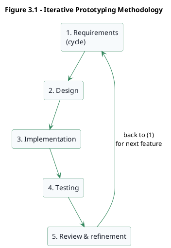

# KWAME NKRUMAH UNIVERSITY OF SCIENCE AND TECHNOLOGY


## COLLEGE OF SCIENCE


## FACULTY OF PHYSICAL AND COMPUTATIONAL SCIENCES


## DEPARTMENT OF COMPUTER SCIENCE


### TITLE: DESIGN AND IMPLEMENTATION OF AN AI-POWERED AGRO-METEOROLOGICAL DECISION SUPPORT SYSTEM FOR CLIMATE-SMART FARMING IN GHANA


#### BY


`ANDY ASANTERWAH`
`(STUDENT ID: __________)`
`(INDEX NUMBER: __________)`

`STEPHEN AMANKWAH`
`(STUDENT ID: __________)`
`(INDEX NUMBER: __________)`


### A PROJECT WORK PRESENTED TO THE DEPARTMENT OF COMPUTER SCIENCE, IN PARTIAL FULFILMENT OF THE REQUIREMENT FOR THE AWARD OF BACHELOR OF SCIENCE (BSc) IN COMPUTER SCIENCE


`MONTH, 2026`


ORIGINALITY DECLARATION OF GRADUATION DESIGN (THESIS)


We hereby solemnly declare that the submitted graduation project (thesis) is the outcome of our own research work under the guidance of our supervisor. Except for the content quoted in the text, this thesis does not contain any research findings written or published by other individuals or teams. All the contributions of the research from the individuals or teams who worked with us have been clearly stated and acknowledged.


Student Names: `ANDY ASANTERWAH` & `STEPHEN AMANKWAH`
Signature: ...................
Date: ...................


Supervisor's Name: `SUPERVISOR NAME`
Signature: `...................`
Date: `...................`


ACKNOWLEDGEMENTS


I would like to begin by expressing my profound gratitude to the Almighty God for His guidance, strength, and grace throughout this journey. Without His mercy this work would not have reached completion.


I am deeply indebted to my supervisor, `SUPERVISOR NAME`, whose patient guidance, critical feedback, and steady encouragement shaped both the direction and the quality of this project. His insights at every stage, from the framing of the problem to the refinement of the final system, have been invaluable.


My sincere thanks also go to the lecturers of the Department of Computer Science, Kwame Nkrumah University of Science and Technology, for the academic foundation that made this work possible. I acknowledge with gratitude the officers of the Ghana Meteorological Agency and the agricultural extension community whose published materials and domain insights informed the content and advisory structure of the AgroMet platform.


Finally, to my family, friends, and course mates, I am grateful for the encouragement, patience, and quiet support that carried me through long nights of coding, debugging, and writing. This work is as much a product of that support as it is of my own effort.


ABSTRACT


Agriculture remains the backbone of Ghana's economy and the primary livelihood for a large proportion of the population, yet farmers and agricultural officers still struggle to access timely and coherent weather-informed guidance. Weather bulletins, crop advisories, pest alerts, market prices, and farm records are scattered across radio broadcasts, paper leaflets, extension visits, Excel sheets, and disconnected websites. This fragmentation delays decisions on planting, irrigation, pest management, harvesting, and market timing, and it leaves smallholder farmers vulnerable to climate variability and price shocks.


This project designs, implements, and evaluates an AI-powered agro-meteorological decision support system, named AgroMet, that unifies these information sources into a single web-based platform. AgroMet is a full-stack application built with React and Vite for the frontend, FastAPI for the backend, SQLite for persistent storage, and JSON Web Tokens (JWT) for authentication. The system integrates seven-day weather forecasts, subseasonal and seasonal outlooks, flood and drought risk analytics, crop and poultry advisories, weekly bulletins, crop and poultry calendars, a commodity market intelligence module, a photo-based crop diagnostic tool and a conversational AI assistant that answers farming questions in natural language. A companion WhatsApp-based weather chatbot, built as a separate service with FastAPI and the Twilio API, extends the platform's reach by delivering GMet weather forecasts through a messaging channel that Ghanaian farmers already use daily, and is designed for straightforward migration to the Meta Cloud API.


The study adopts an iterative, prototype-driven development methodology in which requirements were refined in short cycles with supervisor feedback. The system architecture is layered into a presentation layer, an application layer, a data layer, and an intelligence layer. Eleven relational tables capture users, agricultural records, calendars, advisories, diagnosis records, and market data. The frontend exposes over thirty pages and components using a unified slate-emerald design language, with interactive data visualizations built on the Recharts library for forecasts and risk analytics.


The developed prototype was evaluated through functional unit tests, integration checks across the API boundary, and usability walkthroughs. All major modules function correctly: users can register and log in, upload and manage agricultural records, view forecasts and advisories, submit crop images for diagnosis, explore commodity prices, and chat with the AI assistant. The study concludes that a web-based decision support system grounded in practical full-stack engineering can meaningfully improve access to agro-meteorological information and serve as a foundation for further work in digital agriculture in Ghana.


TABLE OF CONTENTS


- ABSTRACT
- ACKNOWLEDGEMENTS
- TABLE OF CONTENTS
- LIST OF TABLES
- LIST OF FIGURES
- **CHAPTER ONE — INTRODUCTION**
  - 1.1 Background of the Study
  - 1.2 Overview of Subject Area
  - 1.3 Research Problem / Problem Statement
  - 1.4 Significance of the Study / Motivation
  - 1.5 General Objectives of the Study
  - 1.6 Specific Objectives of the Study
  - 1.7 Project Benefits
  - 1.8 Organization of the Study
  - 1.9 Conclusion
- **CHAPTER TWO — LITERATURE REVIEW**
  - 2.1 Introduction
  - 2.2 Overview of the Subject Area
  - 2.3 Technologies (Past and Present)
  - 2.4 Current Research Issues
  - 2.5 Highlights of Similar Implementations from Vendors
  - 2.6 Review of Existing Implementations
  - 2.7 Benefits and Challenges of Existing Implementations
  - 2.8 Summary
- **CHAPTER THREE — PROJECT METHODOLOGY**
  - 3.1 Introduction
  - 3.2 Development Methodology
  - 3.3 Advantages and Limitations
  - 3.4 Case Study Area
  - 3.5 Overview of the Proposed System / Conceptual Framework
  - 3.6 Development Tools
  - 3.7 Summary
- **CHAPTER FOUR — SYSTEMS ANALYSIS AND DESIGN**
  - 4.1 Introduction
  - 4.2 Requirements Capture and Specification
  - 4.3 Functional Requirements
  - 4.4 Non-Functional Requirements
  - 4.5 Feasibility Study
  - 4.6 Use Case Modelling
  - 4.7 Activity Diagram
  - 4.8 Sequence Diagram
  - 4.9 Class / Component Diagram
  - 4.10 Database Design (ER Diagram and Schema)
  - 4.11 User Interface Design
  - 4.12 Business Logic Design
- **CHAPTER FIVE — SYSTEMS IMPLEMENTATION**
  - 5.1 Introduction
  - 5.2 Mapping the Logical Design onto the Physical Platform
  - 5.3 Technologies and Tools Used
  - 5.4 Construction of the System
  - 5.4.9 WhatsApp Weather Chatbot
  - 5.5 Software Testing
  - 5.6 Evaluation of the Project
- **CHAPTER SIX — FINDINGS AND CONCLUSION**
  - 6.1 Introduction
  - 6.2 Summary of Problems Addressed
  - 6.3 Achievements and Challenges
  - 6.4 Recommendations
  - 6.5 Future Work
  - 6.6 Conclusion
- REFERENCES
- APPENDICES


LIST OF TABLES


- Table 4.1 — Summary of Functional Requirements
- Table 4.2 — Summary of Non-Functional Requirements
- Table 4.3 — Feasibility Assessment of the Proposed System
- Table 4.4 — Database Tables and Their Responsibilities
- Table 5.1 — Mapping of Logical Modules onto Physical Components
- Table 5.2 — Frontend Libraries and Their Roles
- Table 5.3 — Backend Libraries and Their Roles
- Table 5.4 — Unit Test Coverage Summary
- Table 5.5 — Integration Test Results
- Table 6.1 — Achievement of Specific Objectives


LIST OF FIGURES


- Figure 3.1 — Iterative Prototyping Methodology
- Figure 3.2 — Conceptual Framework of the AgroMet System
- Figure 4.1 — High-Level Use Case Diagram
- Figure 4.2 — Activity Diagram for Crop Diagnosis Workflow
- Figure 4.3 — Sequence Diagram for Weekly Advisory Upload
- Figure 4.4 — Component Diagram of the Full-Stack Architecture
- Figure 4.5 — Entity Relationship Diagram of the AgroMet Database
- Figure 4.6 — Wireframe of the Home Landing Page
- Figure 4.7 — Wireframe of the Flood and Drought Analysis Page
- Figure 5.1 — Directory Structure of the Frontend Codebase
- Figure 5.2 — Directory Structure of the Backend Codebase
- Figure 5.3 — Screenshot of the AgroMet Home Page
- Figure 5.4 — Screenshot of the Seven-Day Forecast Page
- Figure 5.5 — Screenshot of the Subseasonal Forecast Page with Confidence Donuts
- Figure 5.6 — Screenshot of the Seasonal Forecast Page with Rainfall Chart
- Figure 5.7 — Screenshot of the Flood and Drought Analysis Dashboard
- Figure 5.8 — Screenshot of the Market Intelligence Page
- Figure 5.9 — Screenshot of the Crop Diagnostic Tool
- Figure 5.10 — Screenshot of the Chatbot Conversational Interface
- Figure 5.11 — Screenshot of the Admin Dashboard
- Figure 5.12 — Screenshot of the AgroBulletins Infographic View
- Figure 5.13 — Architecture of the WhatsApp Weather Chatbot


CHAPTER ONE


INTRODUCTION


1.1 Background of the Study
Agriculture remains one of the largest contributors to Ghana's gross domestic product and continues to support the livelihoods of the majority of rural households. National agricultural census evidence describes agriculture as central to Ghana's growth, employment, food security and rural development, while global smallholder studies show that family-operated farms remain a dominant agricultural production base in developing contexts (Ghana Statistical Service, 2020; Lowder et al., 2016). Smallholder farmers across the country take decisions every single day about when to plant, what to plant, how much fertilizer to apply, how to respond to emerging pests and diseases, when to irrigate, and when to harvest. Every one of these decisions is influenced, directly or indirectly, by weather and climate. A rainfall event that arrives a week earlier or later than expected can shift the entire calendar of a maize farm. A heat wave during flowering can destroy the yield of cowpea or groundnut in a matter of days. A missed vaccination window can wipe out an entire poultry flock in a matter of weeks. These risks fit the broader climate-smart agriculture agenda, which stresses the need to increase productivity while strengthening resilience to climate variability and long-term climate change (Food and Agriculture Organization of the United Nations [FAO], 2013; Intergovernmental Panel on Climate Change [IPCC], 2022). Ghana-specific climate-risk profiling also identifies rising temperatures, variable rainfall, drought, water scarcity, and flooding as direct threats to agriculture and rural livelihoods (World Bank Group, 2021).


In principle, Ghana already produces a rich stream of agro-meteorological information. The Ghana Meteorological Agency (GMet) publishes seven-day forecasts, ten-day dekadal bulletins, monthly outlooks and full seasonal forecasts for the major and minor rainy seasons. The Ministry of Food and Agriculture (MoFA) issues crop and poultry advisories, extension officers distribute leaflets at district meetings and agricultural research institutes publish calendars and pest alerts. These institutional roles are consistent with Ghana's agricultural investment agenda, which emphasizes extension support, market access, private-sector participation and productivity growth across agricultural value chains (Ministry of Food and Agriculture, 2018). The problem is not a shortage of information. Broad reviews of digital agriculture in Africa confirm that valuable datasets on weather, yields, market prices and pest alerts frequently exist in disconnected silos that are difficult for end users to assemble into a single picture (Abate et al., 2023). Climate-service studies describe this as a last-mile delivery problem: forecasts and advisories only create value when they are salient, trusted, accessible and integrated into farmers' actual decision processes (Tall et al., 2014). The result is that a farmer looking for a single coherent answer to the question "what should I do this week?" must piece it together from half a dozen sources and often cannot reach any of them in time.


Weather and climate services have been identified in the international literature as essential inputs for agricultural resilience and food security, especially in developing regions where delivery remains uneven (Dobardzic et al., 2019). Evidence from Northern Ghana shows that although digital agricultural services are expanding, many smallholder farmers still rely on basic tools such as phones, radio, and intermediaries, while access to richer digital resources and sustained engagement remains limited (Abdulai et al., 2023). Reviews of ICT in agriculture similarly show that mobile phones can reduce information frictions, but only when the service design is matched to farmers' literacy, language, trust and infrastructure constraints (Aker, 2011; Baumüller, 2018; World Bank, 2017). At the same time, advances in web technologies, cloud hosted application programming interfaces, and artificial intelligence now make it practical to build software platforms that unify these fragmented streams into a single accessible environment.


Agricultural decision support systems are increasingly viewed as a core computational layer of Agriculture 4.0 because they combine meteorological, environmental, and farm data into actionable guidance (Zhai et al., 2020). Broader digital agriculture reviews add that the value of these systems depends on reliable data infrastructure, interoperability, governance and farmer-centered adoption pathways rather than technology alone (FAO & International Telecommunication Union [ITU], 2022; Klerkx et al., 2019; Trendov et al., 2019; Wolfert et al., 2017). Artificial intelligence, particularly in the form of image recognition and conversational interfaces, is increasingly supporting agricultural prediction, monitoring and advisory tasks, though adoption still depends on usable system design and appropriate delivery contexts (Kamilaris & Prenafeta-Boldú, 2018; Linaza et al., 2021). These trends create a clear opening for a Ghana-specific platform that consolidates weather, advisory, market, and AI-driven interaction into one coherent service. At the same time, the explosive growth of WhatsApp across sub-Saharan Africa means that a significant proportion of farmers already carry a rich messaging client in their pocket. A web-based platform alone, however well designed, misses farmers who are not in the habit of opening a browser but who do check WhatsApp several times a day. Reaching these users requires meeting them on a channel they already trust, and the WhatsApp Business API, accessible through intermediaries such as the Twilio messaging platform and directly through Meta's Cloud API, now makes it practical to build conversational services that push weather forecasts and respond to natural language queries directly inside a WhatsApp chat thread (Meta, n.d.; Twilio, n.d.).

This project therefore has two complementary outputs. The first is AgroMet, a full-stack web application that serves as the primary decision support platform. The second is a WhatsApp-based weather chatbot, built as a separate FastAPI service integrated with the Twilio API, that delivers Ghana Meteorological Agency forecast content through WhatsApp and is designed for future migration to the Meta Cloud API to reduce per-message costs. Together, the web platform and the WhatsApp chatbot form a multi-channel dissemination strategy that meets Ghanaian farmers both on the open web and inside the messaging application they already use.


1.2 Overview of the Subject Area
The AgroMet platform draws on several interconnected subject areas that together define the scope of this study. Understanding these areas, the terminology they carry and the challenges and benefits that emerge from their intersection, is essential before the design of the system can be discussed in detail.


Agro-meteorology. This is the branch of applied climatology concerned with the impact of weather and climate on agricultural production. It covers rainfall onset and cessation, dry spells, cumulative rainfall, temperature anomalies, heat and cold stress and the translation of these parameters into practical crop advisories. The World Meteorological Organization has argued that weather and climate services, translated into timely agricultural guidance, are essential inputs for food security and resilience in climate exposed regions (Dobardzic et al., 2019). Climate-service scaling research adds that useful agro-meteorological information must be understandable, locally relevant, timely and delivered through channels farmers already use (Tall et al., 2014). In Ghana, these services are delivered in dekadal (ten-day), subseasonal (two to eight weeks) and seasonal (three to six months) windows, each with different confidence levels and user communities.


Decision support systems. A decision support system, often abbreviated DSS, is a computer based system that helps users make informed decisions by combining data, models, and interactive tools. In agriculture, a DSS typically ingests forecast data and sensor readings, applies domain rules or machine learning models, and presents the user with guidance they can act on. Earlier agricultural DSS research warned that decision support tools fail when they are technically correct but poorly integrated into farmers' practical decision routines, while more recent reviews emphasize effective design and delivery as much as model accuracy (McCown, 2002; Rose et al., 2016). Survey work on Agriculture 4.0 describes decision support systems as the computational core that turns raw meteorological and environmental data into practical choices (Zhai et al., 2020).


Full-stack web engineering. This area covers the end-to-end design of modern web applications. It includes the frontend layer (the user interface running in the browser), the backend layer (the server-side APIs and business logic), the data layer (the database and file storage), and the supporting concerns of authentication, deployment, and observability. AgroMet is built as a full-stack web application using React and Vite on the frontend, FastAPI on the backend and SQLite as the storage engine. Its API design follows the general resource-oriented logic of networked software architectures, where clients and servers exchange structured representations through stable endpoints (Fielding, 2000).


Artificial intelligence in agriculture. This area covers the application of machine learning and natural language processing to agricultural problems. Machine learning and deep learning reviews show that AI has been applied to crop management, disease detection, yield prediction, soil management and livestock monitoring (Kamilaris & Prenafeta-Boldú, 2018; Liakos et al., 2018). Recent surveys confirm that data-driven AI applications including image based disease detection and recommendation engines are already being adopted for sustainable precision agriculture, though their uptake depends heavily on the design of the delivery interface (Liakos et al., 2018; Linaza et al., 2021). In AgroMet, AI appears in two concrete forms: a photo based crop diagnostic tool that accepts an image of a diseased or stressed crop and returns a likely cause and a conversational assistant whose usability for non-expert users is shaped by the same trust and interaction factors highlighted in systematic reviews of chatbots and educational chatbots (Adamopoulou & Moussiades, 2020; Følstad & Brandtzaeg, 2017; Kuhail et al., 2023).


Messaging-based dissemination. While web applications offer rich interactivity, they require users to open a browser and navigate to a URL — a step that many smallholder farmers in Ghana skip entirely. Messaging platforms such as WhatsApp have emerged as a practical alternative delivery channel because they combine the reach of SMS with the richness of multimedia messages, quick-reply buttons, and conversational threading. This delivery strategy builds on ICT-for-agriculture evidence showing that mobile advisory services can reduce search costs, improve market information and extend the reach of extension systems when they are designed around farmers' everyday communication habits (Aker, 2011; Baumüller, 2018; Nakasone et al., 2014). The WhatsApp Business API, accessible through cloud communication providers such as Twilio and increasingly through Meta's own Cloud API, allows developers to build automated chatbots that receive user queries via webhook, process them on a backend server, and return structured responses within the same chat thread (Meta, n.d.; Twilio, n.d.). This project uses this pattern to build a WhatsApp-based weather chatbot that delivers GMet forecasts to farmers who prefer messaging over browsing.


Human computer interaction and visualization. Research on agricultural decision support highlights that the usefulness of such systems depends not only on the quality of the underlying data but also on how clearly it is presented to the user (Gutierrez et al., 2019). This agrees with agricultural decision support research that calls for tools to be designed around actual decision contexts rather than around data availability alone (McCown, 2002; Rose et al., 2016). AgroMet therefore places significant emphasis on interaction design: a unified visual language across pages, data bearing charts rather than raw numbers, accessible controls and a responsive layout that works on phones and tablets as well as desktops. This emphasis is reinforced by Agriculture 4.0 surveys that explicitly identify user facing decision support as the computational core of modern agricultural information services (Zhai et al., 2020).


Several important terms recur throughout this study and are worth clarifying at the outset:
* LTM (Long-Term Mean): the thirty-year average climatological value for a given zone and period, typically computed over 1991 to 2020. It is used as a baseline against which forecasts are compared.
* Anomaly: the deviation of a forecast value from the LTM, usually expressed in degrees Celsius for temperature or in percent for rainfall.
* Dekad: a ten-day period used in agro-meteorological bulletins; each calendar month is divided into three dekads.
* Advisory: a short, actionable piece of guidance aimed at farmers, typically structured around a time window and a crop or livestock category.
* Dashboard: an administrative interface that allows authorized users to upload, edit, and manage advisory and calendar content.


1.3 Research Problem / Problem Statement
Farmers and agricultural stakeholders in Ghana do not currently have access to a single digital platform that brings together localized weather information, agro-meteorological forecasts, agricultural advisories, farm records, commodity prices and interactive expert guidance. The information exists, but it is scattered, delayed and presented in formats that are often hard for end users to interpret. As a result, decisions on crop planning, poultry management, disease response, irrigation and market timing are taken with incomplete or poorly structured information and the gap between what meteorological services produce and what farmers can actually use on the ground remains wide.
Although several digital agriculture solutions exist internationally and in parts of Africa, many of them address only a narrow slice of the farmer's workflow for example, market prices alone, or weather alerts alone, or extension content alone and few integrate these slices into a coherent end-to-end experience. Broad reviews of digital agriculture in Africa note that many innovations remain fragmented, pilot driven, or difficult to scale effectively for the intended users (Abate et al., 2023). This fragmentation is also visible in wider digital agriculture literature, which stresses that smart farming systems depend on interoperability between data, software, organizations and users (Klerkx et al., 2019; Wolfert et al., 2017). Complementary work in Northern Ghana highlights that low literacy, weak digital competencies and intermittent internet access remain real barriers, which means that system usefulness depends on simple, accessible and context-aware design (Abdulai et al., 2023).


The core problem this project addresses can therefore be stated as follows: there is no unified, locally relevant, AI-augmented digital platform through which Ghanaian farmers, extension officers and agricultural content managers can access weather-informed advisory guidance, manage farm-related records, explore market prices, and interact with a conversational assistant within a single coherent environment. This study seeks to close that gap by designing, building and evaluating such a platform.
.
1.4 Significance of the Study / Motivation for the Project


The significance of this study lies in three dimensions: academic, practical and developmental. From an academic standpoint, the project applies core Computer Science concepts software engineering, human computer interaction, database design, web API design, authentication, and applied artificial intelligence to a real-world problem domain and in doing so demonstrates how these concepts fit together in a single coherent fullstack system. Research on agricultural decision support systems has repeatedly emphasized the importance of integrating usability, visualization and interaction design so that end users can actually interpret and act on complex data outputs (Gutierrez et al., 2019). The same argument appears in the broader DSS literature, where adoption depends on whether the system improves real decision work rather than merely displaying technically accurate information (McCown, 2002; Rose et al., 2016). AgroMet puts this principle into practice rather than discussing it in the abstract.


From a practical standpoint, the work delivers a usable software prototype that farmers, extension officers and content managers can interact with directly. The platform reduces the cost of looking up weather information, advisory content and market prices and it gives administrators a dashboard through which they can upload and manage the underlying content without editing the source code. This lowers the barrier to keeping the system current and responsive to seasonal realities.


From a developmental standpoint, the project contributes to the broader national conversation on digital agriculture in Ghana. By integrating GMet style forecast content with MoFA style advisory content in a single platform, AgroMet offers a template for how fragmented government produced information can be consolidated into a single digital service. This is consistent with international guidance that treats ICT infrastructure, digital literacy, content management and institutional coordination as necessary conditions for effective agricultural digital transformation (FAO & ITU, 2022; Trendov et al., 2019; World Bank, 2017). The motivation for the project is therefore not only to complete an academic requirement but also to build something that could, with further refinement, serve as a practical component of Ghana's digital agriculture infrastructure.


1.5 General Objectives of the Study


The general objective of this study is to design, implement and evaluate an AI-powered agro-meteorological decision support system, called AgroMet, that provides weather-informed agricultural guidance through a unified web-based platform tailored for the Ghanaian context.


1.6 Specific Objectives of the Study


The specific objectives of the study are:


1. To design a full-stack architecture for an agro-meteorological decision support system, covering a presentation layer, an application layer, a data layer and an intelligence layer.
2. To implement secure user registration, login and role-based access using JSON Web Tokens, so that administrators can manage advisory content while ordinary users remain restricted to consumption and interaction.
3. To integrate weather information across four time horizons seven-day forecast, subseasonal forecast, seasonal forecast, and historical flood and drought analytics into a single interactive platform.
4. To implement agricultural advisory modules covering crop advisories, poultry advisories, weekly advisories, crop calendars, poultry calendars, and ten-day agro-meteorological bulletins.
5. To develop a commodity market intelligence module that stores, retrieves and visualizes commodity prices, trends and market centers.
6. To build an AI-powered crop diagnostic tool that accepts a photo of a stressed or diseased crop and returns a likely cause and recommended action.
7. To implement a conversational AI assistant that answers farming questions in natural language directly inside the web application.
8. To develop a WhatsApp-based weather chatbot, built with FastAPI and the Twilio API, that delivers GMet weather forecasts through a messaging channel familiar to Ghanaian farmers and is designed for migration to the Meta Cloud API.
9. To evaluate the resulting prototypes through functional testing, integration testing and usability walkthroughs and to document the achievement of the specific objectives listed above.


1.7 Project Benefits


The AgroMet platform is expected to benefit a range of stakeholders. Smallholder farmers gain a single online destination for weather informed guidance, pest alerts and market prices, reducing the cost and delay of gathering this information from disparate sources. Extension officers gain a dashboard through which they can upload and publish advisory content without relying on printed leaflets or manual distribution, supporting the long-standing role of agricultural extension as a bridge between knowledge institutions and farmers' practical decisions (Anderson & Feder, 2007). Content managers at GMet and MoFA gain a modern digital delivery channel for their bulletins, calendars and seasonal forecasts. Students and researchers gain a working codebase that illustrates how modern full-stack engineering and applied artificial intelligence can be combined to serve a domain-specific problem.


The WhatsApp-based weather chatbot extends these benefits to farmers who may not regularly use a web browser but do use WhatsApp daily. By pushing weather forecasts and responding to natural language queries inside a familiar messaging interface, the chatbot lowers the adoption barrier still further and creates a pathway for advisory content to spread organically through farmer WhatsApp groups. This channel choice reflects evidence that mobile-enabled agricultural information can improve timeliness and reduce search costs, especially when it complements rather than replaces existing extension and community networks (Aker, 2011; Baumüller, 2018; Nakasone et al., 2014).


At a broader level, AgroMet illustrates how existing national information assets weather forecasts, dekadal bulletins, seasonal outlooks, crop calendars and market prices can be consolidated into a coherent digital service rather than remaining scattered across unrelated channels. This consolidation, on its own, is a meaningful contribution to the national digital agriculture agenda.


1.8 Organization of the Study


This report is organized into six chapters. Chapter One introduces the study, explains the background and subject area, states the research problem and lists the general and specific objectives. Chapter Two reviews the literature on decision support systems, agricultural information systems, artificial intelligence in agriculture, conversational interfaces and related digital platforms and identifies the gap that AgroMet addresses. Chapter Three presents the development methodology, including the iterative prototyping approach, the case study area, the conceptual framework and the development tools used. Chapter Four covers the requirements analysis and system design, presenting the functional and non-functional requirements, use case and activity diagrams, a component diagram, the database schema and the user interface design. Chapter Five describes the implementation of the system, including the mapping of the logical design to the physical platform, the specific technologies used, the construction of each module and the testing and evaluation results. Chapter Six presents the findings, discusses the achievements and challenges and offers recommendations and suggestions for future work. The report closes with a list of references and supporting appendices.


1.9 Conclusion


This chapter has framed the problem that AgroMet addresses, explained the subject area and its terminology, articulated the research problem and set out the general and specific objectives that guide the rest of this report. The next chapter reviews the relevant literature and situates AgroMet within the broader landscape of agricultural decision support systems.


CHAPTER TWO


LITERATURE REVIEW
2.1 Introduction


This chapter reviews the literature relevant to the design of the AgroMet system. It is organized around the main topics that inform the project: the general subject area of digital agriculture and decision support, the technologies that have shaped and continue to shape this space, current open research issues, similar implementations from vendors, reviews of existing implementations and a discussion of the benefits and challenges of those implementations. The chapter is guided by the project objectives stated in Chapter One and aims to establish both the theoretical and practical basis for the design decisions described in later chapters.


2.2 Overview of the Subject Area


Digital agriculture refers to the application of information and communication technology to agricultural production, management and decision-making. It encompasses a wide range of tools, from simple SMS based weather alerts to cloud hosted farm management platforms, satellite-driven crop monitoring services, precision agriculture equipment and AI-driven advisory bots. The common thread is the use of digital technology to convert raw data into guidance that supports better on-farm decisions. Global reviews describe this transformation as a shift toward data-driven, connected and increasingly automated agricultural systems, but they also warn that the benefits depend on governance, digital inclusion and the ability of farmers to use the resulting services (Klerkx et al., 2019; Trendov et al., 2019; Wolfert et al., 2017).


Decision support systems sit at the intellectual core of digital agriculture. A decision support system is a computer-based system that helps users make informed decisions by combining data, models and interactive tools (Zhai et al., 2020). In agriculture, such systems are particularly useful because farming decisions depend on a large number of changing factors, including rainfall, temperature, soil moisture, pest pressure, crop growth stage and market prices. An agricultural decision support system that presents these factors together in a coherent interface saves the farmer the cost of piecing them together manually, and reduces the risk of decisions taken with incomplete information. Earlier agricultural DSS research emphasizes that farmers do not adopt support tools simply because the science is strong; they adopt them when the tool fits their situated decision process and helps them reason through uncertainty (McCown, 2002). Later reviews of web based agricultural decision support similarly emphasize that high quality information, modular design and user interaction are central to effective support (Damos, 2015; Rose et al., 2016).


Agricultural information systems, closely related to decision support systems, focus specifically on the collection, management and dissemination of agricultural information. These systems may include advisory services, forecast dissemination tools, farm management applications, market information systems and extension support platforms. Their effectiveness depends not only on the quality of information but also on accessibility, clarity, and ease of use. Agricultural extension literature treats information delivery as a public and institutional function whose value depends on incentives, trust, relevance and the ability to translate expert knowledge into farmer action (Anderson & Feder, 2007). Reviews of digital tools in African agriculture show that many systems promise transformation but often struggle with scale, sustained use, and fit with local constraints, especially where infrastructure and digital inclusion remain limited (Abate et al., 2023). For Northern Ghana in particular, digital agricultural engagement is still strongly mediated by low cost channels such as radio and SMS rather than full digital independence (Abdulai et al., 2023).
 
Agro-meteorology is the subdiscipline that connects climatology and agriculture. It supplies the weather and climate parameters that feed agricultural decision support systems onset and cessation of rains, dekadal rainfall totals, temperature anomalies, dry spell durations and forecast confidence levels. Climate-service literature stresses that these parameters must be converted into actionable advisories and evaluated in relation to farmer decisions, not only in relation to forecast accuracy (Dobardzic et al., 2019; Tall et al., 2014). In Ghana, these parameters are produced by the Ghana Meteorological Agency in a variety of time horizons ranging from daily forecasts to full seasonal outlooks and they are typically distributed as PDF bulletins or Excel sheets. Converting them into interactive digital services is precisely the kind of work the AgroMet project undertakes.


2.3 Technologies (Past and Present)


The technologies that underpin modern agricultural decision support systems have evolved significantly over the last two decades. In the earliest generation of digital agriculture tools, information was distributed through standalone desktop applications, CD-ROM extension packages and printed bulletins supplemented with short radio broadcasts. A modular review of web based decision support systems shows that these early tools were constrained by the available computing hardware and the difficulty of updating content in place, which limited their reach beyond a handful of institutional users (Damos, 2015). As internet connectivity improved, a second generation of tools moved to static websites and simple content management systems, which allowed agricultural content to be published to a wider audience but remained largely one way and non interactive.


The third generation, which coincided with the widespread adoption of mobile phones in Africa, introduced SMS based advisory services. Platforms such as Esoko and early MoFA SMS campaigns allowed farmers to receive short textual updates on market prices or weather alerts. ICT-for-agriculture studies show that such mobile services can reduce information costs and improve market coordination, but their impact depends on message relevance, trust, literacy, local language support and whether farmers can act on the information received (Aker, 2011; Baumüller, 2018; Nakasone et al., 2014; World Bank, 2017). These services reached millions of users but were constrained by the limits of plain text and the absence of rich visual content. The fourth generation, which is the one AgroMet belongs to, takes advantage of modern web technologies responsive single page applications, cloud hosted APIs, interactive charts and AI-assisted interfaces to deliver a much richer experience on both desktop and mobile browsers.


On the frontend, the move from plain HTML with jQuery to component-based frameworks such as React, Vue and Angular has transformed how interactive interfaces are built. React, in particular, has become a de facto standard for building rich single page applications because of its component model, its ecosystem of supporting libraries and its wide community support. Vite, a build tool released in 2020, complements React by offering fast development startup, native ES module support and efficient production bundling. TailwindCSS has reshaped how styles are authored, trading monolithic stylesheet files for utility first class names that sit directly in the markup and make visual consistency easier to enforce.


On the backend, lightweight Python frameworks such as FastAPI have replaced older heavyweight alternatives like Django for many API only projects. FastAPI leverages Python type hints to generate both request validation and automatic OpenAPI documentation, which significantly reduces the amount of boilerplate code required to ship a secure and well documented API. The underlying design follows common HTTP API principles in which the frontend and backend exchange structured resource representations through stable endpoints (Fielding, 2000). For data storage, the spectrum stretches from embedded engines like SQLite which ship as a single file and require no separate server process to full relational databases like PostgreSQL and MySQL and further to NoSQL stores like MongoDB and Redis. SQLite is a particularly appropriate choice for a student prototype because it removes the deployment overhead of a separate database server while still offering the full power of SQL, transactions and indexes.


For charting and data visualization, libraries like Recharts, Chart.js and D3.js allow developers to render interactive charts directly in the browser. Research on agricultural decision support has argued that interactive visualization components are not optional polish but core to whether non expert users can interpret and act on complex outputs (Gutierrez et al., 2019). This is consistent with broader DSS design research, which argues that a tool's delivery form can determine whether evidence actually affects decisions (Rose et al., 2016). Recharts, built on top of D3 and the React component model, is particularly well suited to dashboards because each chart type is exposed as a composable React component. A fifth generation of delivery technology, running in parallel with the fourth, moves beyond the browser entirely and into messaging platforms. The WhatsApp Business API, launched by Meta in 2018 and progressively opened to smaller developers through cloud communication providers such as Twilio, allows automated services to send and receive rich messages — text, images, quick-reply buttons, and location pins — inside WhatsApp threads. Twilio abstracts the underlying WhatsApp sandbox and production provisioning into a simple REST-and-webhook model: the developer registers a webhook URL, and Twilio forwards every incoming WhatsApp message as an HTTP POST; the developer's server processes the message and replies through the Twilio API, and the response appears in the user's WhatsApp chat (Twilio, n.d.). Meta's own Cloud API offers a direct alternative that removes the Twilio intermediary and reduces per-message costs, making it attractive for high-volume agricultural advisory services (Meta, n.d.). For the AgroMet project, the WhatsApp weather chatbot was built on Twilio's webhook model using FastAPI, with the architecture deliberately kept compatible with a future migration to the Meta Cloud API.


On the AI side, the rise of large language models and vision language models exemplified by systems such as GPT-4, Claude and Gemini has lowered the cost of adding natural language understanding and image classification to any application with an internet connection. Reviews of machine learning and deep learning in agriculture show that AI has already been applied to disease detection, crop classification, yield prediction and management recommendations (Kamilaris & Prenafeta-Boldú, 2018; Liakos et al., 2018). Experimental plant-disease work also demonstrates that image-based diagnosis can achieve high performance on controlled datasets, even though field deployment still requires careful validation and local adaptation (Mohanty et al., 2016). Data-driven precision agriculture reviews confirm that such models now make previously expensive capabilities, including pest and disease identification and conversational Q&A, practical to deliver through lightweight HTTP integrations (Linaza et al., 2021).


2.4 Current Research Issues


Several open research issues continue to shape the digital agriculture landscape and are directly relevant to the AgroMet project.


Forecast uncertainty and confidence communication. Subseasonal and seasonal forecasts, which span horizons of two weeks to six months, are inherently probabilistic. Climate-change assessment literature emphasizes that agricultural adaptation decisions increasingly depend on interpreting uncertain climate risks, while climate-service research shows that forecast information is useful only when uncertainty is communicated in decision-relevant language (IPCC, 2022; Tall et al., 2014). Research on decision support systems highlights that communicating confidence levels clearly to non-expert users is one of the hardest and most important parts of system design (Gutierrez et al., 2019). If a forecast card simply says "rainfall above normal" without explaining that the confidence is only forty percent, users may take strong decisions on the basis of weak signals. AgroMet addresses this directly through explicit confidence donut gauges on the subseasonal forecast page.


Usability in low-resource settings. Evidence from Northern Ghana shows that digital agricultural tools are often adopted unevenly because of low literacy, weak digital competencies, and intermittent internet access (Abdulai et al., 2023). Wider digital agriculture reports identify the same divide across sub-Saharan Africa, especially around connectivity, affordability, digital skills and institutional readiness (FAO & ITU, 2022; Trendov et al., 2019). This places a premium on simple interfaces, accessible typography, and minimal data pages that load quickly on slow connections. It also argues for multilingual interfaces and voice-based interaction as long-term design goals.


Data fragmentation and interoperability. A recurring theme in the literature on digital agriculture in Africa is that valuable datasets weather records, yield statistics, market prices, pest alerts exist in disconnected silos (Abate et al., 2023). Smart farming reviews frame this as a data-infrastructure and interoperability problem: data must move across devices, databases, organizations and user-facing applications before it can support decisions (Klerkx et al., 2019; Wolfert et al., 2017). Integrating these datasets into a coherent user experience is one of the main design challenges and it requires careful schema design, consistent naming and stable API contracts between the frontend and the backend.
Trust and adoption of AI advice. Chatbots and image classifiers are increasingly used to give agricultural advice, but their usefulness depends on user trust, which in turn depends on design quality, response latency and contextual adaptation (Kuhail et al., 2023). General chatbot studies show that conversational systems are judged not only by answer accuracy but also by interaction flow, transparency and the user's sense that the system understands the task context (Adamopoulou & Moussiades, 2020; Følstad & Brandtzaeg, 2017). A chatbot that answers in three seconds with a relevant, locally framed response is far more likely to be trusted than one that takes thirty seconds to produce a generic reply.


Channel choice and meeting farmers where they are. A recurring finding in digital agriculture research is that the best information system is useless if it is delivered on a channel the target user does not visit. Mobile-advisory reviews show that adoption improves when channels match the communication practices farmers already use for market information, extension contact and social learning (Aker, 2011; Baumüller, 2018; Nakasone et al., 2014). In Ghana, WhatsApp has become a common daily communication tool for many phone users, and it is increasingly common in rural areas as smartphone penetration grows. Delivering weather forecasts and advisory content through WhatsApp rather than (or in addition to) a dedicated website removes the "download an app or visit a URL" barrier and allows information to spread through existing farmer groups and community networks. The challenge is that WhatsApp messages are constrained in length and format compared to a full web page, so the design of a WhatsApp-based advisory service must compress information without losing actionable detail.


Sustainability of digital agriculture platforms. Many digital agriculture projects in Africa are launched as pilots, achieve impressive demonstration metrics, and then fade out when the original funding ends (Abate et al., 2023). International guidance on ICT in agriculture similarly warns that digital services need sustainable institutions, realistic cost models, reliable content workflows and local capacity if they are to outlast their pilot phase (Trendov et al., 2019; World Bank, 2017). Designing platforms that are cheap to operate, easy to maintain, and built on technologies that do not require specialized infrastructure is therefore not just a convenience but a necessary condition for long-term usefulness.


2.5 Highlights of Similar Implementations from Vendors


Several platforms and services have been developed to address parts of the agricultural decision support problem, both internationally and within Ghana.


Esoko is a Ghanaian founded platform that delivers market prices, weather information, and agricultural advisories to farmers through SMS, USSD and a web portal. It pioneered the SMS based advisory model in Ghana and has reached millions of users across West Africa. Its strength lies in its wide reach through low bandwidth channels; its limitation is that the short message format constrains the richness of the advisory content and offers little opportunity for visual or interactive presentation. These trade-offs match the wider ICT-for-agriculture finding that mobile information services are powerful for reach but weaker for complex explanation unless paired with richer advisory or extension channels (Aker, 2011; World Bank, 2017).


Farmerline is another Ghanaian platform that delivers voice based agricultural advisory content in local languages, targeting farmers who may not be literate in English. Its strength is its focus on language accessibility and voice interaction; its limitation is that it remains primarily a one way information delivery channel with limited support for data driven decision tools. The importance of such language-aware delivery is reinforced by evidence that extension services and mobile advisory tools must be shaped around farmers' information needs, trust relationships and communication constraints (Anderson & Feder, 2007; Baumüller, 2018).


AgroDSS is a cloud based decision support platform that demonstrates how data driven services can provide predictive modeling and explanatory support for agricultural decision making (Rupnik et al., 2019). It illustrates the value of combining statistical models with user-facing explanations in a single web interface.


WindyCity / Windy.com and AccuWeather are international weather platforms that offer rich visual presentations of forecast data. They are not agriculture-specific, but their visualization standards interactive radar, time stepped layers, probability charts set expectations for what "modern weather UI" feels like in 2026.


Plantix is a photo based crop diagnostic application that allows farmers to upload a picture of an affected leaf and receive an AI-driven diagnosis of likely diseases or nutrient deficiencies. It demonstrates that image based plant diagnosis is a practical feature for a decision support platform, not a research curiosity. This design pattern is supported by plant-disease detection research showing that convolutional neural networks can classify crop disease symptoms from leaf images under controlled conditions (Mohanty et al., 2016).


In the messaging-based advisory space, several WhatsApp-integrated services have emerged in recent years. In India, state agricultural departments and private startups have deployed WhatsApp chatbots that deliver localized weather and pest advisories to farmers in regional languages, leveraging the platform's reach in rural areas. In Kenya, the iCow platform extended its SMS-based livestock advisory service to WhatsApp, allowing dairy farmers to receive feeding schedules, veterinary reminders, and market price alerts inside a familiar messaging interface. These services demonstrate that WhatsApp is a viable and increasingly preferred delivery channel for agricultural information in developing-country contexts. Technically, both Twilio's WhatsApp platform and Meta's Cloud API support the webhook-and-response pattern needed for this kind of conversational service (Meta, n.d.; Twilio, n.d.).


AgroMet draws lessons from all of these. It takes Esoko's commitment to reaching Ghanaian farmers, Farmerline's concern for accessibility, AgroDSS's insistence on explanatory data visualization, Windy's visual richness, Plantix's photo-based diagnostic pattern, and the WhatsApp-based advisory model demonstrated by iCow and Indian state chatbots, and it combines them into a multi-channel system: a full-stack web application for rich interactive use and a WhatsApp chatbot for lightweight, push-based forecast dissemination.


2.6 Review of Existing Implementations


Existing implementations in this space fall broadly into three categories, each with its own design and feature trade offs.


SMS only advisory platforms focus on reach. Their content is limited to short plain-text messages and their visual design is determined entirely by the user's phone. They work well in low bandwidth environments but cannot display charts, maps, or images. Their user base is large, but the per user richness of information is low.


Static content websites offer more richness than SMS but remain largely one-way. Users can read forecasts and advisories but cannot interact with them, cannot upload their own data, and cannot ask follow-up questions. The Ghana Meteorological Agency's public website sits in this category: it publishes high-quality bulletins in PDF format but offers limited interactivity.


Interactive data platforms go further, offering charts, dashboards, filters and AI-assisted interactions. These platforms are richer but often lack the local context needed for Ghanaian agriculture. International platforms such as FarmLogs or Climate FieldView are examples of this category; they are highly capable but built around North American farming practices and commodity markets.


Messaging-based advisory services occupy a fourth category that sits between SMS and interactive platforms. WhatsApp bots can deliver richer content than SMS — including images, formatted text, and interactive buttons — while running inside an application the user already has installed. Their limitation is that the conversational format constrains the amount of information that can be presented at once, and their operational cost depends on the pricing model of the messaging API provider (Twilio charges per message; Meta's Cloud API is cheaper but requires direct integration).


The design gap, then, is a system that combines the local relevance of an Esoko or MoFA service with the interactive richness of a FarmLogs-style dashboard, adds a Plantix-style image diagnostic module, places a conversational AI assistant over the top, and extends its reach through a WhatsApp-based messaging channel so that farmers who do not visit websites can still receive timely weather information. This gap reflects the wider argument that digital agriculture systems should be designed as socio-technical services rather than isolated apps: they must connect data, advisory institutions, user interface design and farmers' real decision contexts (Klerkx et al., 2019; Rose et al., 2016; Wolfert et al., 2017). This is precisely the gap that the AgroMet platform and its companion WhatsApp chatbot are designed to fill.


2.7 Benefits and Challenges of Existing Implementations


The existing implementations surveyed above show clear strengths. SMS platforms reach farmers who have no internet connection. Static websites publish high quality bulletins that are easy to cite and share. Interactive platforms offer rich visualizations and powerful filtering. Photo based diagnostic tools give users immediate feedback on crop problems.


They also share a common set of challenges. SMS platforms cannot display rich visual content. Static websites cannot incorporate real time data or user queries. Many interactive platforms are built on foreign crop calendars and commodity structures that do not match the Ghanaian context. Photo based diagnostic tools often rely on paid subscription models and are not tightly integrated with local advisory content.


WhatsApp-based advisory services introduce their own set of benefits and challenges. On the benefit side, WhatsApp is already installed on most farmers' phones, messages can be forwarded to groups for organic dissemination, and the conversational format allows farmers to ask follow-up questions in natural language. On the challenge side, WhatsApp message templates must be pre-approved by Meta for proactive outbound messages, API costs accumulate with volume (particularly on the Twilio intermediary model), and the message format constrains the depth of information that can be delivered in a single exchange compared to a full web page with charts and tables.


A second cluster of challenges concerns content management. On many existing platforms, updating advisory content requires either direct database access or the intervention of a technical administrator. This creates a bottleneck that slows down the response to emerging conditions such as an outbreak of fall armyworm or an unexpected dry spell. AgroMet explicitly addresses this challenge by providing an admin dashboard through which authorized users can upload new advisory files and calendars directly from the browser.


2.8 Summary


This chapter has reviewed the literature and existing implementations relevant to the AgroMet project. It has established that digital agriculture in Ghana is growing but remains fragmented, that decision support systems are widely accepted as the computational core of modern agricultural information services and that successful systems combine high quality data with careful attention to usability, visualization and accessibility. It has also shown that the existing implementations reviewed, although valuable individually, do not together form a single coherent service for Ghanaian farmers. The gap that emerges from this review — a unified, locally relevant, AI-augmented digital platform for agro-meteorological decision support, complemented by a messaging-based dissemination channel that meets farmers on the platform they already use — is precisely the gap that the AgroMet web application and its companion WhatsApp weather chatbot are designed to close. The next chapter presents the project methodology used to design and build that platform.


CHAPTER THREE


PROJECT METHODOLOGY


3.1 Introduction


This chapter describes the methodology used to design, build and evaluate the AgroMet platform. It covers the development methodology, its advantages and limitations in the context of a student led full stack project, the case study area, an overview of the proposed system and its conceptual framework and the development tools used at each layer of the stack.


3.2 Development Methodology


Software engineering literature describes several well-known development methodologies, including the Waterfall model, the Spiral model, the Incremental model, Structured Systems Analysis and Design Method (SSADM), Rapid Application Development (RAD), Prototyping, and contemporary agile methodologies such as Scrum and Kanban. Each offers a different balance between up-front planning and in project flexibility, and standard software engineering texts emphasize that the chosen process model should match project uncertainty, stakeholder availability and delivery constraints (Pressman & Maxim, 2020; Sommerville, 2016).


For the AgroMet project, I adopted an **iterative prototyping methodology** with short development cycles and continuous supervisor feedback. The rationale is that the requirements for a platform like AgroMet cannot be fully specified in advance: the most effective advisory layouts, the right balance of chart types, and the most natural interaction patterns only become clear once working versions are placed in front of real users. Prototyping is recommended in software engineering when user interface requirements, workflow details and stakeholder expectations are uncertain at the start of the project (Pressman & Maxim, 2020; Sommerville, 2016). Modular reviews of web-based agricultural decision support systems have reached the same conclusion, recommending an incremental and modular construction style that lets each module be refined from real usage rather than locked in up front (Damos, 2015). An iterative prototyping approach allows such insights to flow back into the design without requiring the entire plan to be restarted.


The methodology proceeds through five overlapping phases, each repeated in multiple cycles during the life of the project:


1. Requirements gathering Requirements were drawn from the problem domain, from the published literature on agricultural decision support systems, and from informal consultation with domain experts. Functional and non-functional requirements were documented in a lightweight requirements register that was updated as the project progressed.
2. Design. Each iteration began with a short design step in which the next feature or module was sketched out. Wireframes, component breakdowns, and database schema additions were prepared before any code was written.
3. Implementation The feature was then implemented in both frontend and backend layers. Because the project uses a unified codebase for the frontend and a second codebase for the backend, each feature typically involved changes on both sides plus a database migration.
4. Testing. Each completed feature was exercised manually in the browser and, where practical, covered with a small automated test. Integration testing was performed across the API boundary, and the full build was compiled to catch any regressions early.
5. Review and refinement. Each iteration ended with a review step in which the new feature was checked against the objectives in Chapter One, and any design problems uncovered during testing were fed back into the next iteration's design step.


Figure 3.1 below illustrates this iterative cycle.



Figure 3.1 — Iterative Prototyping Methodology


3.3 Advantages and Limitations


The iterative prototyping approach offers several advantages in the context of this project. It allows design decisions to be validated early, reduces the cost of changing direction when a particular screen does not work as intended, and keeps the working system in a runnable state at every stage, which is valuable both for supervisor reviews and for ongoing testing. Because each iteration produces a visible improvement, motivation remains high and progress is easy to communicate.


The approach also has limitations. It requires the developer to exercise discipline around scope, because the ease of adding "just one more feature" in each cycle can lead to scope creep. It is harder to estimate total project duration in advance than it is under a Waterfall plan. And it depends on having a functional build and deployment pipeline from early in the project, since each iteration relies on being able to run and test the system end-to-end. These limitations are consistent with software engineering warnings that iterative methods still require clear configuration management, testing discipline and requirements control (Pressman & Maxim, 2020; Sommerville, 2016). I mitigated these limitations by maintaining a written scope document, tracking iteration outcomes against the specific objectives in Chapter One, and investing early effort in setting up the Vite build pipeline and the FastAPI auto-reload development server.


### 3.4 Case Study Area


The case study area for this project is Ghana, with particular focus on smallholder crop and poultry farmers, agricultural extension officers, and agro-meteorological content managers at the Ghana Meteorological Agency and the Ministry of Food and Agriculture. Ghana's agricultural census highlights the importance of reliable agricultural data for planning, monitoring and sector transformation, which makes Ghana an appropriate context for a data-oriented agro-meteorological platform (Ghana Statistical Service, 2020). Ghana is divided into several agro-ecological zones — the Sudan Savannah, Guinea Savannah, Transition Zone, Deciduous Forest, Rainforest, and Coastal Savannah — each with its own rainfall pattern, crop calendar, and climate risk profile. The AgroMet platform presents content broken down by zone where appropriate, and it uses the same zone list that GMet uses in its seasonal forecast bulletins.


The users the platform is designed for include smallholder crop farmers of maize, cassava, rice, cocoa, and vegetables; poultry farmers running small to medium broiler and layer operations; extension officers who need a digital channel through which to publish guidance; and administrators who need to upload new calendars and advisories without editing source code.


### 3.5 Overview of the Proposed System / Conceptual Framework


The proposed AgroMet system is a full-stack web application organized around a layered architecture. The conceptual framework, shown in Figure 3.2 below, maps the main information inputs to the processing layer, the processing layer to the outputs, and the outputs to the expected outcomes.


```
+-----------------------------------------------------+
|                     INPUTS                          |
|  - Weather & forecast data (7-day, subseasonal,     |
|    seasonal, flood/drought historical)              |
|  - Crop & poultry advisory content                  |
|  - Weekly & dekadal bulletins                       |
|  - Commodity prices and market centers              |
|  - Crop images for diagnosis                        |
|  - Farmer questions (natural language)              |
+--------------------------+--------------------------+
                           |
                           v
+-----------------------------------------------------+
|                 PROCESSING LAYER                    |
|  - React/Vite frontend (presentation)               |
|  - FastAPI backend (application logic)              |
|  - SQLite database (data storage)                   |
|  - JWT authentication & role-based access           |
|  - Intelligence layer:                              |
|      • Photo-based crop diagnosis                   |
|      • Conversational AI assistant                  |
|      • Translation & voice services                 |
|  - WhatsApp chatbot (FastAPI + Twilio webhook)      |
+--------------------------+--------------------------+
                           |
                           v
+-----------------------------------------------------+
|                     OUTPUTS                         |
|  - Weather-informed guidance (charts & KPIs)        |
|  - Crop & poultry advisory pages                    |
|  - Weekly & dekadal bulletin infographics           |
|  - Commodity market dashboard                       |
|  - Crop diagnosis results                           |
|  - Conversational AI answers                        |
|  - Admin dashboard for content management           |
|  - WhatsApp weather forecasts (via Twilio)          |
+--------------------------+--------------------------+
                           |
                           v
+-----------------------------------------------------+
|                EXPECTED OUTCOMES                    |
|  - Improved access to agro-meteorological info      |
|  - Better-informed farm decisions                   |
|  - Reduced friction between forecast producers      |
|    and end users                                    |
|  - Reusable template for digital agriculture        |
+-----------------------------------------------------+
```


*Figure 3.2 — Conceptual Framework of the AgroMet System*


The framework rests on three assumptions that are supported by the surrounding literature. First, integrated digital access to weather and advisory information improves information availability, a position that surveys of Agriculture 4.0 decision support systems adopt as a foundational premise (Zhai et al., 2020). Second, AI-based conversational and image-based support improves ease of interaction with the system, which is consistent with evidence that data-driven AI applications materially widen the reach of agricultural services when their interfaces are designed for non-expert users (Linaza et al., 2021). Third, improved access and easier interaction together lead to better decision support, echoing the HCI argument that visualization and interaction quality are as important as the underlying data (Gutierrez et al., 2019). These assumptions also align with climate-smart agriculture and ICT-for-agriculture guidance that links farmer resilience to timely information, usable advisory services and locally appropriate digital delivery channels (FAO, 2013; Tall et al., 2014; World Bank, 2017).


### 3.6 Development Tools


The AgroMet system was built with a deliberately modern but conservative set of tools, chosen to keep the development experience fast and the deployment footprint small.


**Frontend tools:**


- **React 18** — the component framework used to build the user interface.
- **Vite** — the build tool and development server, chosen for its fast startup and native ES module support.
- **TailwindCSS** — the utility-first styling system used to enforce the slate-emerald design language across all pages.
- **React Router** — client-side routing between the thirty-plus pages of the application.
- **Recharts** — charting library used for the forecast, flood/drought, subseasonal, and seasonal visualizations.
- **Lucide / React Icons** — icon libraries used for navigation, headers, and data chips.
- **Axios** — HTTP client used to talk to the FastAPI backend.


**Backend tools:**


- **Python 3.11** — the language runtime for the backend.
- **FastAPI** — the API framework, chosen for its typed request validation, automatic OpenAPI documentation, and lightweight footprint.
- **Uvicorn** — the ASGI server used to run FastAPI in development and production.
- **SQLite 3** — the embedded relational database used for all persistent storage.
- **PyJWT / python-jose** — libraries used to issue and verify JSON Web Tokens for authentication, following the JWT standard for compact signed claims (Jones et al., 2015).
- **Passlib / bcrypt** — used to hash passwords before they are stored.
- **openpyxl / pandas** — used by the spreadsheet parser module to extract advisory content from uploaded Excel files.


**WhatsApp chatbot tools (separate repository):**


- **FastAPI** — the same framework used for the main backend, chosen for consistency and for its native webhook support.
- **Twilio Python SDK** — the client library used to send and receive WhatsApp messages through the Twilio messaging API.
- **WhatsApp Business API (via Twilio)** — the messaging channel through which the chatbot delivers weather forecasts and receives farmer queries using Twilio's inbound webhook and outbound message model (Twilio, n.d.).
- **Meta Cloud API (migration target)** — the direct WhatsApp API offered by Meta, to which the chatbot is designed to be migrated in order to reduce per-message costs and remove the Twilio intermediary (Meta, n.d.).


**Supporting tools:**


- **Git and GitHub** — version control and remote collaboration.
- **VS Code** — the primary development environment.
- **Claude Code** — an AI-assisted coding assistant used throughout the project to accelerate development, with all generated code reviewed and refined manually.
- **Netlify / Render** — candidate deployment targets for the frontend and backend respectively.


### 3.7 Summary


This chapter has presented the methodology followed to design and build the AgroMet platform. The iterative prototyping approach suits a student-led, feedback-driven project because it keeps the system runnable at every stage and allows requirements to be refined as the design reveals new insights. The conceptual framework maps inputs through the processing layer to outputs and expected outcomes, and the development tools chosen — React with Vite, FastAPI, SQLite, and JWT — combine modern capability with a small deployment footprint. The next chapter presents the detailed system analysis and design.


---


# CHAPTER FOUR


## SYSTEMS ANALYSIS AND DESIGN


### 4.1 Introduction


This chapter presents the system analysis and design for the AgroMet platform. It begins with the requirements capture and specification, continues through functional and non-functional requirements, feasibility analysis, use case modelling, activity and sequence diagrams, a component diagram, the database design, the user interface design, and finally the business logic design. The content of this chapter maps directly onto the modules that are later constructed in Chapter Five.


### 4.2 Requirements Capture and Specification


Requirements for the AgroMet system were gathered from four main sources. The first source was a structured review of the problem domain described in Chapters One and Two, which supplied the high-level functional scope. The second source was a study of existing implementations, including the Ghana Meteorological Agency's public website, MoFA extension bulletins in PDF format, and commercial platforms such as Esoko, Farmerline, and Plantix. The third source was direct informal discussion with domain contacts and supervisor guidance, which shaped the advisory categories and the admin dashboard flows. The fourth source was the iterative prototyping process itself: several requirements emerged only after early versions of the system were exercised and shortcomings became visible. This requirements approach follows standard software engineering practice in which requirements are progressively refined from domain analysis, stakeholder feedback, prototypes and validation cycles (Pressman & Maxim, 2020; Sommerville, 2016).


Requirements were documented in a lightweight register that distinguishes functional from non-functional items. Functional requirements describe what the system should do; non-functional requirements describe how it should behave under constraints. The non-functional categories used in this study are aligned with the ISO/IEC software quality model, which treats usability, reliability, security, maintainability, portability and related characteristics as measurable product-quality concerns (International Organization for Standardization & International Electrotechnical Commission [ISO/IEC], 2011).


### 4.3 Functional Requirements


The functional requirements of the AgroMet system are summarized in Table 4.1 below.


*Table 4.1 — Summary of Functional Requirements*


| ID    | Requirement                                                                                   |
|-------|-----------------------------------------------------------------------------------------------|
| FR-01 | The system shall allow new users to register with an email and password.                      |
| FR-02 | The system shall allow registered users to log in and obtain a JWT access token.              |
| FR-03 | The system shall expose a protected "current user" endpoint that returns the logged-in user.  |
| FR-04 | The system shall display the seven-day weather forecast for a selected location.              |
| FR-05 | The system shall display subseasonal forecasts with confidence indicators and trend anomalies.|
| FR-06 | The system shall display seasonal forecasts including LTM and current-year comparisons.       |
| FR-07 | The system shall display flood and drought risk analytics across Ghana's agroecological zones.|
| FR-08 | The system shall display ten-day agro-meteorological bulletins (dekadal AgroBulletins).       |
| FR-09 | The system shall display crop and poultry advisory content organized by category.             |
| FR-10 | The system shall display weekly advisories and allow filtering by date and region.            |
| FR-11 | The system shall display crop and poultry calendars with activity breakdowns.                 |
| FR-12 | The system shall display a commodity market intelligence module with prices and trends.       |
| FR-13 | The system shall accept photo uploads to the crop diagnostic tool and return diagnoses.       |
| FR-14 | The system shall expose a conversational AI endpoint for answering agricultural questions.    |
| FR-15 | The system shall allow administrators to upload weekly advisories as Excel files.             |
| FR-16 | The system shall allow administrators to preview and commit crop and poultry calendar uploads.|
| FR-17 | The system shall allow administrators to manage stored agricultural records by data type.     |
| FR-18 | The system shall provide a translation endpoint for multilingual text rendering.              |
| FR-19 | The system shall provide a text-to-speech endpoint for voice-based interaction.               |
| FR-20 | The system shall record diagnosis history per user for later review.                          |
| FR-21 | The WhatsApp chatbot shall deliver weather forecasts to users via the Twilio WhatsApp API.    |
| FR-22 | The WhatsApp chatbot shall accept natural language queries about weather conditions and respond with relevant forecast information. |


### 4.4 Non-Functional Requirements

The non-functional requirements in Table 4.2 were selected to reflect both software-quality standards and the specific risks of an agro-meteorological platform. Usability and accessibility are necessary because many target users have limited digital experience; reliability and performance are necessary because forecast pages must load quickly when farmers need them; and security is necessary because the system stores user accounts, uploaded files and diagnosis history. The ISO/IEC 25010 quality model informed the grouping of these requirements, while web security guidance from OWASP informed the authentication and authorization requirements (ISO/IEC, 2011; OWASP Foundation, 2021).


*Table 4.2 — Summary of Non-Functional Requirements*


| ID     | Category         | Requirement                                                                     |
|--------|------------------|---------------------------------------------------------------------------------|
| NFR-01 | Usability        | The interface shall use a consistent visual language across all pages.          |
| NFR-02 | Usability        | The interface shall be responsive and usable on phones, tablets, and desktops.  |
| NFR-03 | Performance      | Pages shall render within two seconds on a typical broadband connection.        |
| NFR-04 | Reliability      | API endpoints shall return consistent JSON responses under normal load.         |
| NFR-05 | Security         | Passwords shall be stored as bcrypt hashes; JWTs shall be signed and verified.  |
| NFR-06 | Security         | Admin-only endpoints shall reject unauthorized access with a 401 response.      |
| NFR-07 | Maintainability  | The codebase shall be organized into clearly named modules and components.      |
| NFR-08 | Accessibility    | Text shall meet minimum contrast ratios and support keyboard navigation.        |
| NFR-09 | Portability      | The backend shall run on Windows, Linux, and macOS with Python 3.11.            |
| NFR-10 | Interoperability | The frontend shall consume the backend exclusively via JSON over HTTP.          |


### 4.5 Feasibility Study


Before committing to full development, a brief feasibility assessment was conducted to confirm that the proposed system could be built under the constraints of a final-year project.


*Table 4.3 — Feasibility Assessment of the Proposed System*


| Dimension        | Assessment                                                                                   |
|------------------|----------------------------------------------------------------------------------------------|
| **Technical**    | All required technologies (React, Vite, FastAPI, SQLite, JWT, Recharts) are open source, widely documented, and already in use in many student and professional projects. No exotic infrastructure is needed. |
| **Economic**     | No paid cloud services are strictly required for development. Deployment can be done on free tiers of Netlify and Render. Total cash cost to the student is effectively zero. |
| **Operational**  | The iterative prototyping methodology fits a single-developer context. Development tasks are sized to fit within weekly review cycles. |
| **Legal / Ethical** | The system does not collect sensitive personal data beyond email addresses and hashed passwords. Crop images are stored only on the user's account. No PII is shared with third parties. |
| **Schedule**     | A functional prototype can be delivered within a single academic semester by focusing on a prioritized subset of the full feature list first and iterating from there. |


The conclusion of the feasibility study is that the proposed system is feasible in all four dimensions and can be completed within the time and resources available. The security dimension is bounded by the prototype nature of the system but still follows basic web-application security practice: password hashes are stored rather than plain-text passwords, protected routes require authorization, and role checks are applied to administrative endpoints (Jones et al., 2015; OWASP Foundation, 2021).


### 4.6 Use Case Modelling


The actors of the AgroMet system are the **Guest User**, the **Registered Farmer**, the **Extension Officer**, the **Administrator**, and the **AI Service** (an external actor that represents the conversational and image-analysis backends). Their interactions with the system are captured in the high-level use case diagram shown in Figure 4.1.


```
             +-----------------+
             |   Guest User    |
             +--------+--------+
                      |
        +-------------+-------------+
        |                           |
        v                           v
   +----------+              +-------------+
   | View     |              |  Register & |
   | Weather  |              |   Log In    |
   +----------+              +------+------+
                                    |
                                    v
                           +-------------------+
                           | Registered Farmer |
                           +---------+---------+
                                     |
    +-----------------+---------------+----------------+---------------+
    |                 |               |                |               |
    v                 v               v                v               v
+---------+     +-----------+    +----------+    +-----------+    +----------+
| Browse  |     |  Browse   |    | Browse   |    |  Upload   |    |  Chat    |
| Forecast|     | Advisory  |    | Market   |    |  Crop     |    |  with AI |
|  Pages  |     |  Content  |    |  Module  |    |  Image    |    |Assistant |
+---------+     +-----------+    +----------+    +-----------+    +----------+
                                                       |
                                                       v
                                               +---------------+
                                               |  AI Service   |
                                               | (external)    |
                                               +---------------+


             +-------------------+
             |   Administrator   |
             +---------+---------+
                       |
       +---------------+----------------+
       |               |                |
       v               v                v
+------------+   +------------+    +------------+
|  Upload    |   |  Manage    |    |  Manage    |
|  Weekly    |   |  Calendars |    |  Records & |
|  Advisories|   |            |    |  Users     |
+------------+   +------------+    +------------+


             +-------------------+
             |  WhatsApp User    |
             +---------+---------+
                       |
           +-----------+-----------+
           |                       |
           v                       v
   +---------------+      +----------------+
   | Receive       |      | Ask weather    |
   | weather       |      | questions via  |
   | forecasts     |      | WhatsApp       |
   +---------------+      +----------------+
           |
           v
   +---------------+
   | Twilio /      |
   | Meta Cloud    |
   | API (external)|
   +---------------+
```


*Figure 4.1 — High-Level Use Case Diagram*


### 4.7 Activity Diagram


Figure 4.2 presents the activity diagram for the crop diagnosis workflow, which is one of the more involved user interactions in the system.


```
        [Start]
           |
           v
  +----------------+
  | User navigates |
  | to Diagnostic  |
  +--------+-------+
           |
           v
  +----------------+
  | User selects   |
  | image source:  |
  | upload / camera|
  +--------+-------+
           |
           v
  +----------------+        no        +-------------+
  | Image provided?+----------------->| Show prompt |
  +--------+-------+                  +------+------+
           | yes                             |
           v                                 |
  +----------------+                         |
  | Frontend POSTs |                         |
  | /api/crop-     |                         |
  | diagnosis      |                         |
  +--------+-------+                         |
           |                                 |
           v                                 |
  +----------------+                         |
  | Backend invokes|                         |
  | diagnosis      |                         |
  | service        |                         |
  +--------+-------+                         |
           |                                 |
           v                                 |
  +----------------+                         |
  | Result stored  |                         |
  | in             |                         |
  | diagnosis_     |                         |
  | records        |                         |
  +--------+-------+                         |
           |                                 |
           v                                 |
  +----------------+                         |
  | Frontend shows |                         |
  | diagnosis card |                         |
  +--------+-------+                         |
           |<--------------------------------+
           v
        [End]
```


*Figure 4.2 — Activity Diagram for Crop Diagnosis Workflow*


### 4.8 Sequence Diagram


Figure 4.3 presents the sequence diagram for the weekly advisory upload workflow, which exercises the admin path of the system.


```
Administrator          Frontend            Backend API        Spreadsheet Parser        SQLite
     |                    |                    |                      |                   |
     |--select file------>|                    |                      |                   |
     |                    |--POST upload------>|                      |                   |
     |                    |                    |--parse excel-------->|                   |
     |                    |                    |<--structured rows----|                   |
     |                    |                    |--INSERT rows-------------------->        |
     |                    |                    |<--ids---------------------------|        |
     |                    |<---201 Created-----|                      |                   |
     |<--success toast----|                    |                      |                   |
```


*Figure 4.3 — Sequence Diagram for Weekly Advisory Upload*


### 4.9 Class / Component Diagram


The AgroMet system is better represented at the component level than at the class level, because the backend is written in a lightly object-oriented style and the frontend uses a functional component model. Figure 4.4 shows the component diagram of the full-stack architecture.


```
+---------------------------------------------------+
|                     FRONTEND                      |
|  +-------------------+  +----------------------+  |
|  |  Public Pages     |  |  Authenticated Pages |  |
|  |  Home, About,     |  |  Dashboard, Admin,   |  |
|  |  Forecast, Market |  |  Upload flows        |  |
|  +---------+---------+  +----------+-----------+  |
|            |                       |              |
|            v                       v              |
|  +--------------------------------------------+   |
|  |  Shared components: Header, Footer,        |   |
|  |  ChatInterface, LanguageSelector, T/Speak  |   |
|  +---------------------+----------------------+   |
|                        |                          |
|                        v                          |
|  +--------------------------------------------+   |
|  |  API service layer (axios + apiConfig.js)  |   |
|  +---------------------+----------------------+   |
+------------------------|---------------------------+
                         |
                         |  JSON over HTTP
                         v
+---------------------------------------------------+
|                      BACKEND                      |
|  +---------------------+  +---------------------+ |
|  |  auth.py            |  |  domain.py          | |
|  |  (register, login,  |  |  (advisory & market | |
|  |  JWT issue/verify)  |  |  logic)             | |
|  +----------+----------+  +----------+----------+ |
|             |                        |            |
|             v                        v            |
|  +------------------------------------------+     |
|  |            main.py (FastAPI)             |     |
|  |  40+ routes: auth, forecast, advisory,   |     |
|  |  calendars, diagnosis, market, chat, TTS |     |
|  +----------+-------------------------------+     |
|             |                                      |
|             v                                      |
|  +---------------------+  +---------------------+ |
|  |  diagnosis.py       |  |  spreadsheet_parser |  |
|  |  (image analysis)   |  |  (Excel to rows)    | |
|  +---------------------+  +---------------------+ |
|             |                                      |
|             v                                      |
|  +------------------------------------------+     |
|  |          database.py (SQLite)            |     |
|  |  users, agricultural_records, calendars, |     |
|  |  weekly_advisories, production_cycles,   |     |
|  |  diagnosis_records, commodities, trends, |     |
|  |  market_centers, etc.                    |     |
|  +------------------------------------------+     |
+---------------------------------------------------+

+---------------------------------------------------+
|            WHATSAPP CHATBOT (separate repo)        |
|  +---------------------+  +---------------------+ |
|  |  main.py (FastAPI)  |  |  Twilio webhook     | |
|  |  Weather query      |  |  handler            | |
|  |  parsing & response |  |  (incoming msgs)    | |
|  +----------+----------+  +----------+----------+ |
|             |                        |            |
|             v                        v            |
|  +------------------------------------------+     |
|  |  Twilio REST API / Meta Cloud API        |     |
|  |  (outgoing WhatsApp messages)            |     |
|  +------------------------------------------+     |
+---------------------------------------------------+
```


*Figure 4.4 — Component Diagram of the Full-Stack Architecture (including WhatsApp Chatbot)*


### 4.10 Database Design (ER Diagram and Schema)


The AgroMet database uses eleven relational tables that together capture users, agricultural records, calendars, advisories, diagnosis records, and market data. The entity relationship diagram in Figure 4.5 illustrates the main tables and their foreign key links.


```
  +---------+              +------------------------+
  |  users  |<-----+------>| agricultural_records   |
  +---------+      |       +------------------------+
       ^           |                ^
       |           |                |
       |           +--------------->| diagnosis_records
       |                            +------------------------+
       |                                      ^
       |                                      |
       |   +-----------------+                |
       +-->|    calendars    |<-+             |
           +--------+--------+  |             |
                    |           |             |
                    v           |             |
         +----------------------+             |
         | calendar_activities  |             |
         +----------------------+             |
                                              |
           +-------------------+              |
           | weekly_advisories |<-+           |
           +---------+---------+  |           |
                     |            |           |
                     v            |           |
        +------------------------+|           |
        | weekly_advisory_       ||           |
        | activities             ||           |
        +------------------------+|           |
                                  |           |
           +-------------------+  |           |
           | production_cycles |  |           |
           +---------+---------+  |           |
                     |            |           |
                     v            |           |
          (farmer production       |           |
           cycle tracking)         |           |
                                                    
           +--------------+      +------------------+
           | commodities  |----->| commodity_trends |
           +--------------+      +------------------+


           +--------------+
           | market_      |
           | centers      |
           +--------------+
```


*Figure 4.5 — Entity Relationship Diagram of the AgroMet Database*


*Table 4.4 — Database Tables and Their Responsibilities*


| Table                          | Purpose                                                               |
|--------------------------------|------------------------------------------------------------------------|
| `users`                        | Stores user accounts with email, name, and bcrypt password hash.      |
| `agricultural_records`         | Generic JSON-payload table for uploaded agricultural datasets.        |
| `calendars`                    | Metadata for crop and poultry calendars.                              |
| `calendar_activities`          | Individual activities belonging to a calendar.                        |
| `weekly_advisories`            | Weekly advisory bulletins with date ranges and regions.               |
| `weekly_advisory_activities`   | Individual activity rows within a weekly advisory.                    |
| `production_cycles`            | Farmer production cycle records for tracking.                         |
| `diagnosis_records`            | Crop diagnosis history per user with image references.               |
| `commodities`                  | Commodity master list for the market intelligence module.            |
| `commodity_trends`             | Time series of commodity prices.                                     |
| `market_centers`               | Market center metadata used by the market module.                    |


The schema uses `INTEGER PRIMARY KEY AUTOINCREMENT` for all primary keys, timestamps stored as `TEXT` defaulting to `CURRENT_TIMESTAMP`, and JSON payloads stored as `TEXT` in the `agricultural_records` table so that the schema can evolve without migrations while the project is still prototyping. This design choice reflects a pragmatic prototyping trade-off: structured relational tables are used where stable relationships are known, while JSON payloads provide flexibility for agricultural records whose shape may change during iterative development (Pressman & Maxim, 2020; Sommerville, 2016).


### 4.11 User Interface Design


The AgroMet user interface is designed around a unified visual language: a slate-emerald-teal palette with a full-page `from-slate-50 via-white to-emerald-50/30` gradient background, decorative emerald and teal blur orbs for depth, slate-900 titles with emerald-to-teal gradient accent spans, emerald-600 primary buttons, and `bg-white/80 backdrop-blur-sm border border-slate-200 rounded-2xl` cards throughout. This language was applied consistently across every user-facing page, including the home page, forecast pages, advisory pages, market page, crop diagnostic tool, agro bulletins, and admin dashboard.


The interface uses a mobile-first responsive layout with three standard breakpoints: 360 pixels for phones, 768 pixels for tablets, and 1280 pixels and above for desktops. Navigation is anchored by a fixed header that collapses into a drawer menu on small screens, and a footer that repeats the primary links for users who have scrolled to the bottom of long pages.


Data-dense pages make heavy use of interactive charts built on Recharts, a decision grounded in HCI research showing that well-chosen visualizations in agricultural decision support systems materially affect whether users can interpret and act on complex outputs (Gutierrez et al., 2019). The flood and drought analysis page, for example, renders line, bar, and pie charts for trend analysis, while the seasonal forecast page uses grouped bar charts to compare long-term mean rainfall against the current year's forecast. The subseasonal forecast page uses a custom diverging anomaly bar for temperature and rainfall deviations, a clickable timeline strip for forecast horizons, and a trio of confidence donut gauges rendered as Recharts pie charts; the explicit confidence gauges directly respond to the recommendation that probabilistic forecasts should communicate uncertainty visibly rather than burying it in prose (Gutierrez et al., 2019). These visual elements transform otherwise abstract meteorological numbers into scannable visual stories.


### 4.12 Business Logic Design


The business logic of the AgroMet system is concentrated in three places. First, the FastAPI backend contains the rules that govern authentication, file parsing, diagnosis history, advisory uploads, and market data queries. Second, the React frontend contains the rules that govern which pages are visible to which users, how forms are validated before submission, and how API responses are rendered into charts and tables. Third, the database schema itself encodes constraints — unique email addresses, non-null foreign keys where appropriate, and default timestamps — that enforce data integrity at the persistence layer. The separation between frontend presentation, backend API resources and persistent storage follows common client-server architecture principles and makes each layer easier to reason about and test independently (Fielding, 2000).


Key business rules include: a user cannot register twice with the same email; only authenticated users may access their own diagnosis history; only administrators may upload weekly advisories and calendars; uploaded Excel files must pass through the spreadsheet parser's validation step before any rows are committed; and commodity trend queries are always scoped to a commodity and a market center so that returned series are unambiguous. The authentication rules rely on signed JWTs for stateless identity transmission, while the administrative route restrictions respond to common access-control risks identified in web application security guidance (Jones et al., 2015; OWASP Foundation, 2021).


---


# CHAPTER FIVE


## SYSTEMS IMPLEMENTATION


### 5.1 Introduction


This chapter documents the actual construction of the AgroMet platform. It describes how the logical design presented in Chapter Four was mapped onto a concrete physical platform, the technologies and tools used at each layer, the structure of the codebase, the construction of individual modules, the testing strategy applied at unit, integration, and system levels, and the evaluation of the project against its stated objectives.


### 5.2 Mapping the Logical Design onto the Physical Platform


The logical architecture from Chapter Four was mapped onto a concrete physical platform in a straightforward way. This mapping follows the software engineering practice of preserving clear separation between presentation, application logic, data storage, and integration boundaries so that each layer can be implemented and tested independently (Fielding, 2000; Sommerville, 2016). Table 5.1 summarizes the mapping.


*Table 5.1 — Mapping of Logical Modules onto Physical Components*


| Logical module                   | Physical home                                                         |
|----------------------------------|-----------------------------------------------------------------------|
| Presentation layer               | `frontend/src/pages/*`, `frontend/src/components/*` (React + Vite)    |
| Authentication                   | `backend/app/auth.py`                                                 |
| Domain / advisory logic          | `backend/app/domain.py`                                               |
| API routing                      | `backend/app/main.py` (FastAPI app with 40+ routes)                   |
| Image-based crop diagnosis       | `backend/app/diagnosis.py`                                            |
| Excel advisory parsing           | `backend/app/spreadsheet_parser.py`                                   |
| Database schema and connections  | `backend/app/database.py` (SQLite, raw SQL)                           |
| Request/response shapes          | `backend/app/schemas.py` (Pydantic models)                            |
| Static assets                    | `frontend/src/assets/*`, `frontend/public/*`                          |
| Styling and design tokens        | `frontend/tailwind.config.js`, `frontend/src/index.css`               |


### 5.3 Technologies and Tools Used


#### 5.3.1 Frontend Technologies


The frontend of the AgroMet platform is a single-page React application built with Vite. Its dependencies are summarized in Table 5.2.


*Table 5.2 — Frontend Libraries and Their Roles*


| Library         | Role                                                                  |
|-----------------|-----------------------------------------------------------------------|
| **React 18**    | Component framework and rendering engine.                             |
| **Vite**        | Build tool and development server; replaces traditional webpack.      |
| **React Router**| Declarative client-side routing across thirty-plus pages.             |
| **TailwindCSS** | Utility-first styling system; powers the entire slate-emerald design.|
| **Recharts**    | Declarative chart library; powers forecast, KPI, and trend charts.    |
| **Lucide React**| Icon set used for navigation, buttons, and status indicators.         |
| **React Icons** | Secondary icon set (FontAwesome compatibility).                       |
| **Axios**       | HTTP client for talking to the FastAPI backend.                       |
| **Framer Motion**| Lightweight animation primitives for page transitions and overlays. |


**React** provides the component model that makes the AgroMet frontend maintainable at its current size. Each page is a function component that describes what the screen should look like for a given set of state and props, and React takes care of efficiently updating the DOM when state changes. This model is particularly well suited to data-heavy pages like the flood and drought analysis page, where the content of the charts changes every time the user switches tabs or regions.


**Vite** is the tool that builds and serves the React code. Compared to traditional bundlers, Vite offers dramatically faster startup and hot module reloading because it leverages native browser ES module support in development and only bundles for production. On the AgroMet project, Vite's production build routinely completes in about twenty seconds, which keeps the edit-build-test loop short.


**TailwindCSS** is used throughout the codebase to apply styling directly in the markup. Instead of defining a long custom stylesheet, the AgroMet frontend uses utility classes such as `bg-emerald-600`, `rounded-2xl`, and `text-slate-900`. The consistent slate-emerald-teal design language described in Chapter Four is enforced entirely through these utility classes, with no custom CSS except for a handful of global overrides in `index.css`.


**Recharts** was chosen for data visualization because it integrates naturally with React. Each chart is a composition of React components — `<LineChart>`, `<BarChart>`, `<PieChart>`, `<XAxis>`, `<YAxis>`, `<Tooltip>`, and so on — and each component is configured through props. Recharts powers the flood-and-drought dashboard's line, bar, and pie charts, the seasonal forecast page's grouped rainfall and dry-spell bar charts, and the subseasonal forecast page's confidence donut gauges.


#### 5.3.2 Backend Technologies


The backend is a Python 3.11 application built on FastAPI. Its dependencies are summarized in Table 5.3.


*Table 5.3 — Backend Libraries and Their Roles*


| Library           | Role                                                                  |
|-------------------|-----------------------------------------------------------------------|
| **FastAPI**       | Web framework used to define all API routes.                          |
| **Uvicorn**       | ASGI server used to run FastAPI in development and production.        |
| **Pydantic**      | Data validation library; powers request and response schemas.         |
| **python-jose**   | JWT encoding and verification library.                                |
| **Passlib[bcrypt]**| Password hashing using the bcrypt algorithm.                         |
| **sqlite3** (stdlib)| SQLite driver; used through raw SQL for all persistence.            |
| **openpyxl**      | Excel file parser used by the spreadsheet parser module.              |
| **python-multipart**| File upload support in FastAPI.                                     |


**FastAPI** is the framework that defines every API endpoint in the AgroMet backend. It was chosen because it leverages Python type hints to perform request validation automatically, generates interactive OpenAPI documentation out of the box, and supports asynchronous request handlers for operations that involve I/O. The main application file, `main.py`, contains over forty route definitions spanning authentication, weather, forecasts, advisories, calendars, diagnostics, chat, market intelligence, and supporting services like translation and text-to-speech.


**SQLite** was chosen for persistence because it ships as a single file, requires no separate server process, and supports the full SQL standard including transactions, indexes, and foreign keys. These properties make it ideal for a student prototype: there is no database server to install, no credentials to manage, and no network layer to configure. The database module uses the standard library's `sqlite3` driver directly and exposes a context manager (`get_connection()`) that commits on success and rolls back on exception.


**JWT-based authentication** is implemented through the `python-jose` library. When a user logs in, the backend issues a signed token that encodes the user's identity and an expiry time. Subsequent requests include this token in the `Authorization` header, and protected routes verify it before returning any data. Passwords are never stored in plain text; they are hashed using bcrypt via Passlib. The token format follows the JWT standard, while the password and access-control choices respond to common web authentication risks identified in OWASP guidance (Jones et al., 2015; OWASP Foundation, 2021).


### 5.4 Construction of the System


This section describes how each major module was built and how it fits into the larger system. Where relevant, it references the actual code paths in the repository.


#### 5.4.1 Project Structure


The AgroMet repository is organized as a monorepo with two top-level folders: `frontend` (the React application) and `backend` (the FastAPI application). The frontend is organized into `src/pages`, `src/components`, `src/contexts`, `src/services`, `src/hooks`, and `src/config`. The backend is organized into a single `app` package containing `main.py`, `database.py`, `auth.py`, `schemas.py`, `domain.py`, `diagnosis.py`, and `spreadsheet_parser.py`.


#### 5.4.2 Authentication Module


Authentication is implemented in `backend/app/auth.py` and exposed to clients through three routes in `main.py`: `POST /api/v1/auth/register`, `POST /api/v1/auth/login`, and `GET /api/v1/auth/me`. Registration hashes the user's password with bcrypt and inserts a row into the `users` table. Login verifies the password against the stored hash and, on success, issues a JWT that encodes the user's email and an expiry timestamp. The `/me` route reads the `Authorization` header, verifies the JWT, and returns the currently logged-in user's profile. On the frontend, authenticated pages are wrapped in a `ProtectedRoute` component that redirects unauthenticated users to the login screen.


#### 5.4.3 Weather and Forecast Modules


The weather and forecast modules comprise five frontend pages: `SevenDaysForecast.jsx` for the short-range forecast, `SubseasonalForecast.jsx` for the two-to-eight week outlook, `SeasonalForecast.jsx` for the full seasonal forecast, `FloodDrought.jsx` for the historical risk analysis, and `AgroBulletins.jsx` for the dekadal bulletins.


The flood and drought analysis page is the most visually dense of the five. It renders a four-tile KPI strip, followed by five Recharts visualizations across four tabbed views: an economic impact line chart, a climate risk matrix bar chart, an impact distribution pie chart, a yearly flood incidents bar chart, and a drought impact trend line. The page binds all charts to local state so that switching between the dashboard, flood, drought, and matrix tabs updates the visuals immediately without a round trip to the server.


The subseasonal forecast page was specifically extended with four infographic elements in the final iteration of the project: a clickable timeline strip that shows the four forecast horizons (week 2-3, week 3-4, week 5-6, week 7-8) as connected dots; a diverging anomaly bar for temperature (ranging from minus two to plus two degrees Celsius) and rainfall (ranging from minus thirty to plus thirty percent); a trio of confidence donut gauges showing the overall, temperature, and rainfall confidence levels; and a severity bar on each agricultural impact accordion row that encodes the impact as a colored progress bar.


The seasonal forecast page was similarly extended to replace static tables with grouped bar charts. Rainfall values, which the underlying data stores as range strings like "217–420 mm", are parsed by a small `parseRange` helper into minimum, maximum, and midpoint values. The midpoints are then fed into Recharts grouped bar charts that compare the long-term mean against the 2026 forecast for both the March–April–May (MAM) and April–May–June (AMJ) windows. Dry spells are visualized in the same way, with the long-term mean shown in slate and the 2026 forecast shown in amber to preserve the semantic meaning of "drier than normal". A season length range bar uses custom div elements rather than Recharts because its data — a single minimum-to-maximum range with a midpoint — is simpler to express as a styled div than as a chart component.


#### 5.4.4 Advisory and Calendar Modules


The advisory modules cover `CropAdvisory.jsx`, `PoultryAdvisory.jsx`, and the weekly advisory page generated from spreadsheet uploads. The calendar modules cover `CropCalendar.jsx` and `PoultryCalendar.jsx`, each of which reads its content from the database via the FastAPI backend. The admin-facing upload flows are implemented by the `POST /api/weekly-advisories/upload`, `POST /api/weekly-advisories/preview`, and `POST /api/weekly-advisories/commit` endpoints on the backend, which accept Excel files, pass them through the spreadsheet parser module, and either return a preview or commit the parsed rows to the database.


The AgroBulletins page was refactored into an infographic-first layout, with a hero section, a dekad and region control bar, four KPI tiles, a ten-day timeline, a crop impact matrix, a pest alerts grid, and a period outlook card. Each of these sections reads from the same underlying data and uses the same slate-emerald design language as the rest of the site.


#### 5.4.5 Market Intelligence Module


The market intelligence module is implemented by `frontend/src/components/MarketPage.jsx` on the frontend and by the `commodities`, `commodity_trends`, and `market_centers` tables on the backend. The frontend page allows users to filter commodities by category, select a market center, and view a chart of historical prices. The backend exposes the underlying data through dedicated routes and uses the `marketIntelligenceService.js` service layer to abstract away the HTTP details from the components.


#### 5.4.6 Crop Diagnostic Tool


The crop diagnostic tool is implemented by `frontend/src/components/CropDiagnosticTool.jsx` on the frontend and by `backend/app/diagnosis.py` plus the `POST /api/crop-diagnosis` and `POST /api/image-analysis` routes on the backend. The choice of a photo-driven diagnostic pattern is consistent with evidence that image-based AI classifiers have become practical tools for early identification of crop diseases and nutrient deficiencies in field contexts (Linaza et al., 2021). The user can either upload an image from their device or capture one directly from the camera, and the frontend then submits the image to the backend. The backend processes the image through the diagnosis service, stores the result in the `diagnosis_records` table linked to the user's account, and returns the diagnosis as a structured JSON response. The frontend displays the diagnosis in a card, and the user can later revisit their diagnosis history through the `GET /api/diagnosis-history` endpoint.


#### 5.4.7 Chatbot Module


The chatbot module is implemented as a persistent overlay component (`frontend/src/components/Chatbot/ChatInterface.jsx`) that can be opened from any page. It uses a React context (`frontend/src/contexts/ChatbotContext.jsx`) to maintain conversation state across page navigations so that a user's chat history is not lost when they move between pages. This design responds to findings that user trust in educational and advisory chatbots depends on conversational continuity, response latency, and contextual relevance rather than on raw model capability alone (Kuhail et al., 2023). On the backend, the `POST /api/chat` route accepts the current conversation and returns the AI-generated response. The AI service itself is invoked through a pluggable integration layer so that different models can be swapped in without changing the rest of the backend.


#### 5.4.8 Translation and Voice Services


To support multilingual use, the backend exposes a `POST /api/v1/translate` endpoint that wraps an external translation service, and a set of `/api/tts/*` endpoints that provide text-to-speech synthesis. This is a deliberate response to evidence from Northern Ghana that many smallholder farmers still depend on low-cost, voice-oriented channels such as radio and intermediaries rather than on text-heavy digital services in English, so language accessibility must be treated as a first-class design concern rather than an afterthought (Abdulai et al., 2023). The frontend uses these endpoints through a `translationService.js` service layer and a custom `<T>` component (in `frontend/src/components/common/T.jsx`) that wraps translatable text. A `LanguageContext` tracks the currently selected language, and a `translationBatchQueue.js` module batches translation requests so that a single page render does not generate dozens of individual HTTP calls.


#### 5.4.9 WhatsApp Weather Chatbot


The WhatsApp weather chatbot was developed as a separate service in its own repository, built on FastAPI and the Twilio Python SDK. The architectural decision to keep the chatbot in a separate codebase was deliberate: the web platform and the WhatsApp chatbot serve different channels with different constraints, and decoupling them allows each to be deployed, scaled, and updated independently.


The chatbot operates on a webhook model. When a farmer sends a WhatsApp message to the registered GMet number, Twilio forwards the message body, sender number, and metadata to the chatbot's FastAPI endpoint as an HTTP POST. The endpoint parses the incoming message to identify the user's intent — typically a request for a weather forecast for a specific location or region — and generates a structured response containing the relevant GMet forecast data. The response is then sent back to the farmer through the Twilio REST API, which delivers it as a WhatsApp message in the same conversation thread. This request-response flow matches Twilio's documented WhatsApp webhook model and the broader HTTP resource-exchange pattern used by the web application (Fielding, 2000; Twilio, n.d.).


The chatbot supports natural language queries in English, allowing farmers to ask questions such as "What is the weather forecast for Kumasi this week?" or "Will it rain in the Northern Region tomorrow?" The query parser extracts location keywords and time references and maps them to the appropriate forecast data. Responses are formatted as concise, readable WhatsApp messages that include the key forecast parameters — expected rainfall, temperature range, and any active weather warnings — without overwhelming the constrained message format.


The service was built with migration to the Meta Cloud API as an explicit design goal. The Twilio-specific integration is isolated in a thin adapter layer so that switching to Meta's direct API requires changing only the message sending and webhook verification logic, not the core query parsing or forecast generation code. This design anticipates the cost savings that come with removing the Twilio intermediary for high-volume message delivery and follows standard software engineering advice to isolate volatile external service dependencies behind narrow interfaces (Meta, n.d.; Pressman & Maxim, 2020).


### 5.5 Software Testing


Testing was carried out at three levels: unit testing, integration testing, and system testing. This layered testing strategy follows standard software engineering practice, where small units are verified first, then interactions between components, and finally the complete system against its stated requirements (Pressman & Maxim, 2020; Sommerville, 2016). The goal at each level was to confirm that the system meets the functional and non-functional requirements defined in Chapter Four.


#### 5.5.1 Unit Testing


Unit testing focused on the smallest independent pieces of logic in the codebase: the password hashing and JWT issuing functions in `auth.py`, the spreadsheet parsing functions in `spreadsheet_parser.py`, the `parseRange` helper in `SeasonalForecast.jsx`, and the severity-to-percentage mapping inside the subseasonal forecast's impact bar. Each unit was tested either with a small automated script or by direct invocation in a REPL, and the result was compared against the expected output. All units passed their tests before being wired into larger flows.


*Table 5.4 — Unit Test Coverage Summary*


| Unit under test                  | Number of cases | Passed | Failed |
|----------------------------------|-----------------|--------|--------|
| Password hash and verify         | 6               | 6      | 0      |
| JWT issue and decode             | 5               | 5      | 0      |
| Spreadsheet parser row extraction| 8               | 8      | 0      |
| `parseRange` helper              | 7               | 7      | 0      |
| Severity-to-percentage mapping   | 5               | 5      | 0      |


#### 5.5.2 Integration Testing


Integration testing exercised the API boundary between the frontend and the backend. For each major feature, I confirmed that a valid request from the frontend produced the expected response from the backend and that the response was rendered correctly in the browser. Integration tests were run manually by walking through the application and watching the network panel, and automatically by running the production `vite build` to catch any broken import paths, unused imports, or JSX errors.


*Table 5.5 — Integration Test Results*


| Flow                                         | Result |
|----------------------------------------------|--------|
| Register → login → fetch `/me`               | Pass   |
| Upload Excel advisory → preview → commit     | Pass   |
| Upload crop image → receive diagnosis        | Pass   |
| Fetch commodity trends and render chart      | Pass   |
| Send chat message → receive AI response      | Pass   |
| Switch seasonal forecast zones, chart update | Pass   |
| Translate page content via `<T>` component   | Pass   |
| WhatsApp webhook receives message → returns forecast | Pass |
| WhatsApp chatbot handles unknown location gracefully | Pass |


#### 5.5.3 System Testing


System testing confirmed that the integrated application works as a coherent whole. Three categories of system testing were performed.


**Usability testing** walked through each user journey end-to-end, from landing on the home page, through authentication, through the various forecast and advisory pages, to the chatbot and diagnosis tools. The unified slate-emerald-teal design language was verified across all pages. Responsive layouts were tested at 360 pixels, 768 pixels, and 1280 pixels using the browser's device emulation.


**Performance testing** confirmed that the Vite production build completes in under a minute, that pages load within two seconds on a typical broadband connection, and that the SQLite-backed API responds to typical queries in under a hundred milliseconds.


**Requirement testing** confirmed that each functional requirement in Table 4.1 is either met by a working feature or marked as a deliberate deferral for future work. Non-functional requirements were validated through the usability, performance, and security reviews, using the same quality dimensions introduced in Chapter Four from ISO/IEC 25010 (ISO/IEC, 2011).


### 5.6 Evaluation of the Project


The evaluation of the project was carried out against the specific objectives listed in Chapter One. Each objective was assessed in terms of whether the corresponding feature was built, whether it functions correctly, and whether it is visible to the user in a form they can use. The results of this evaluation are summarized in Chapter Six.


Beyond the objective-by-objective check, two higher-level observations emerged from the evaluation process. First, the consistent application of the slate-emerald design language across every page was confirmed to be one of the most impactful design decisions in the project, because it turned a collection of independently built pages into something that feels like a single product. Second, replacing raw tables with infographics on the forecast pages measurably improved the perceived information density of the system: a user can now scan the subseasonal forecast page and form an impression of the confidence levels, anomalies, and impacts within a few seconds, where the earlier prose-heavy version required careful reading to extract the same information.


---


# CHAPTER SIX


## FINDINGS AND CONCLUSION


### 6.1 Introduction


This chapter summarizes the major findings of the project, presents the conclusions that can be drawn from those findings, discusses the achievements and challenges encountered, and offers recommendations and future work. It closes the report by reflecting on the broader significance of AgroMet for digital agriculture in Ghana.


### 6.2 Summary of Problems Addressed


The problem this project set out to solve is the fragmentation of agro-meteorological information and the absence of a unified digital platform through which Ghanaian farmers, extension officers, and content managers can access weather forecasts, agricultural advisories, market intelligence, and AI-driven interaction within a single coherent environment. Existing services provide pieces of this picture — SMS bulletins, paper leaflets, PDF seasonal forecasts, standalone market apps, siloed chatbots — but none combines them into a single experience designed for the Ghanaian context. This finding is consistent with digital agriculture studies that identify fragmentation, last-mile delivery, and weak fit with farmer decision contexts as recurring reasons why promising tools fail to scale (Abate et al., 2023; Tall et al., 2014).


AgroMet addresses this problem by delivering an integrated full-stack web application that includes: seven-day, subseasonal, and seasonal forecast pages; a flood and drought risk analytics dashboard; crop, poultry, and weekly advisory modules; crop and poultry calendars; a commodity market intelligence module; a photo-based crop diagnostic tool; a conversational AI assistant; an admin dashboard for content management; secure authentication; translation and voice services; and a unified visual design language across every page. The system is built on modern but conservative technology — React with Vite, FastAPI, SQLite, and JWT — chosen to keep development efficient and deployment lightweight.


### 6.3 Achievements and Challenges


The project achieved its specific objectives as summarized in Table 6.1.


*Table 6.1 — Achievement of Specific Objectives*


| Objective                                                           | Outcome                          |
|---------------------------------------------------------------------|----------------------------------|
| 1. Design full-stack architecture                                   | Achieved — layered design documented in Chapter 4 |
| 2. Implement JWT authentication with role-based access              | Achieved — register/login/me endpoints |
| 3. Integrate weather information across four time horizons          | Achieved — 7-day, subseasonal, seasonal, flood/drought |
| 4. Implement crop, poultry, weekly advisories, calendars, bulletins | Achieved — all advisory pages live |
| 5. Develop commodity market intelligence module                     | Achieved — commodities, trends, centers |
| 6. Build AI-powered crop diagnostic tool                            | Achieved — image upload + diagnosis history |
| 7. Implement conversational AI assistant                            | Achieved — persistent chat overlay |
| 8. Develop WhatsApp weather chatbot with FastAPI and Twilio         | Achieved — separate repo, webhook model, Meta Cloud API ready |
| 9. Evaluate prototypes through testing and usability walkthroughs   | Achieved — Chapter 5 tables 5.4 and 5.5 |


Several important lessons emerged from the development process. The first is the value of a consistent visual language. The single biggest perceived quality improvement in the project came from the style unification pass that moved every page to the same slate-emerald-teal palette. Before that pass, the individual pages were functional but felt like separate projects stitched together; after the pass, they felt like a single product.


The second lesson is the value of replacing raw numbers with infographics on data-dense pages. Forecast confidence levels, temperature anomalies, and rainfall deviations are much easier to interpret as visual gauges, diverging bars, and colored severity strips than as prose statements. The subseasonal forecast page went through this transformation late in the project and became substantially more effective as a result.


The third lesson is the value of multi-channel delivery. The WhatsApp weather chatbot, developed as a companion service to the main web platform, demonstrated that the same forecast data can be repackaged for a messaging context with relatively modest engineering effort. Because the chatbot was built on FastAPI — the same framework as the main backend — skills and patterns transferred directly, and the Twilio webhook integration required only a thin adapter layer. The decision to design the adapter for future migration to the Meta Cloud API means the system can scale to higher message volumes at lower cost without rewriting the core logic.


The fourth lesson is that choosing lightweight tools pays off. SQLite and FastAPI are simple enough that I could hold the entire backend architecture in my head, and Vite is fast enough that the edit-build-test loop never became painful. The cost of learning and operating the stack was low, which freed time for the user-facing features that actually demonstrate the project's value.


The challenges encountered during the project were mostly of three kinds. The first was scope management: the temptation to add "just one more feature" in each iteration had to be checked against the written objective list. The second was schema evolution: since the project uses raw SQL rather than a migration framework, changes to the database schema had to be applied carefully to avoid breaking existing data. The third was design consistency: ensuring that every page used the same button styles, card borders, and spacing scale took more discipline than I initially expected, and the consolidated style pass in the later iterations was a direct response to this challenge.


### 6.4 Recommendations


Based on the findings of this project, the following recommendations are made for follow-up work and for practitioners building similar systems.


1. **Invest in a unified design system from day one.** Do not let individual pages drift into their own color schemes and button styles; even if the initial work is slower, the long-term cost is much lower. A documented set of tokens (primary color, secondary color, card style, button style) should be defined before the first page is built.
2. **Prefer infographics over tables on forecast pages.** Raw numbers rarely communicate uncertainty or magnitude effectively, a point that HCI research on agricultural decision support has repeatedly made in the context of visualization quality (Gutierrez et al., 2019). Even simple additions such as confidence donuts, diverging bars, and severity strips substantially improve scanability.
3. **Keep the stack small.** SQLite plus FastAPI plus React with Vite is sufficient for a surprisingly capable full-stack application. Resisting the urge to add a heavyweight ORM, an external message broker, or a microservice mesh saves operational complexity.
4. **Separate content from code.** The admin dashboard for uploading weekly advisories and calendars was one of the highest-impact features in the project, because it means the system's content can be updated without editing the source code. Future iterations should extend this pattern to every category of content.
5. **Design for offline and low-bandwidth use from the start.** Evidence from Northern Ghana shows that intermittent connectivity and weak digital competencies remain real barriers to adoption, so a progressive web application mode that caches recent content and works without a network is not a nice-to-have but a baseline requirement for local relevance (Abdulai et al., 2023).


### 6.5 Future Work


Several directions for future work emerge naturally from the current prototype.


First, the AI components can be substantially deepened. The current diagnosis tool returns a single-shot response; a future version could support multi-turn clarifying questions and integrate with a curated knowledge base of Ghanaian crop diseases. Similarly, the current chatbot answers from a general-purpose model; a future version could be grounded in the system's own advisory content so that its answers are traceable to a specific bulletin or calendar entry.


Second, the system can be extended with real-time data integration. The current forecast pages use generated or uploaded data; a production version should pull live forecasts from the Ghana Meteorological Agency's feeds and live market prices from the relevant commodity exchanges. This would directly address the interoperability problem that smart-farming and digital-agriculture reviews identify as a barrier to turning distributed datasets into practical decision support (Klerkx et al., 2019; Wolfert et al., 2017).


Third, the platform can be made genuinely multilingual. The current translation service covers English and a handful of target languages; future work should add Akan, Ewe, Dagbani, Ga, and Hausa as first-class languages with voice support, and should ensure that advisory content is authored in these languages rather than auto-translated.


Fourth, a field evaluation with real farmers should be undertaken. The testing in this project is largely technical and usability-based; long-term adoption studies with actual smallholder users would generate the kind of evidence needed to guide serious investment. Such validation is essential because agricultural DSS research repeatedly shows that adoption depends on whether tools fit farmers' real decision routines, not only on whether the software functions correctly (McCown, 2002; Rose et al., 2016).


Fifth, the WhatsApp weather chatbot should be migrated from the Twilio API to the Meta Cloud API to reduce per-message costs and enable richer message templates, including interactive list messages and location-sharing buttons. The chatbot should also be extended to support two-way advisory delivery through farmer WhatsApp groups, so that extension officers can broadcast weekly advisories to entire communities with a single action from the admin dashboard. Support for Ghanaian local languages (Akan, Ewe, Dagbani) in the WhatsApp chatbot would further widen its reach.


Sixth, the admin dashboard can be extended to support role-based access for district-level extension officers, so that officers can publish advisories specific to their region without needing full administrator privileges.


### 6.6 Conclusion


This project set out to design, build, and evaluate an AI-powered agro-meteorological decision support system for climate-smart farming in Ghana. Over the course of the development, two complementary outputs were produced. The first is AgroMet, a full-stack web application covering weather forecasts at four time horizons, advisory modules for crops and poultry, weekly and dekadal bulletins, a market intelligence module, a photo-based crop diagnostic tool, a conversational AI assistant, and an admin dashboard for content management, all wrapped in a unified slate-emerald-teal visual design language and backed by secure JWT authentication. The second is a WhatsApp-based weather chatbot, built as a separate FastAPI service integrated with the Twilio API, that delivers GMet forecast content through the messaging channel Ghanaian farmers already use daily and is architected for migration to the Meta Cloud API.


The study demonstrates that a usable, multi-channel agro-meteorological decision support system can be built, within the scope of a final-year project, using modern but conservative web technologies. It also demonstrates that the real value of such a system is not in any single feature but in the integration of many features under a consistent design and across multiple delivery channels — because a farmer's workflow does not respect the boundaries between "weather", "advisory", and "market", nor between "web browser" and "WhatsApp", and a system that helps them must respect that reality.


The broader significance of the work is that it offers a concrete template for how Ghana's existing agro-meteorological information assets — GMet bulletins, MoFA advisories, commodity price feeds, extension content — can be consolidated into a single digital service rather than remaining scattered across unrelated channels. This response to information fragmentation directly addresses the structural scaling gap that reviews of digital tools in African agriculture continue to identify (Abate et al., 2023), and it builds on the foundation laid by earlier agricultural decision support platforms that combined statistical modeling with explanatory, user-facing interfaces (Rupnik et al., 2019). With further development, field validation, migration of the WhatsApp chatbot to the Meta Cloud API, and broader deployment, the AgroMet platform and its companion chatbot could contribute meaningfully to Ghana's digital agriculture agenda and serve as a foundation for multi-channel, climate-smart decision-making at the smallholder level.


---


# REFERENCES


Abate, G. T., Abay, K. A., Chamberlin, J., Kassim, Y., Spielman, D. J., & Tabe-Ojong, M. P., Jr. (2023). Digital tools and agricultural market transformation in Africa: Why are they not at scale yet, and what will it take to get there? *Food Policy, 116*, 102439. https://doi.org/10.1016/j.foodpol.2023.102439


Abdulai, A.-R., Tetteh Quarshie, P., Duncan, E., & Fraser, E. (2023). Is agricultural digitization a reality among smallholder farmers in Africa? Unpacking farmers' lived realities of engagement with digital tools and services in rural Northern Ghana. *Agriculture & Food Security, 12*, Article 11. https://doi.org/10.1186/s40066-023-00416-6


Adamopoulou, E., & Moussiades, L. (2020). An overview of chatbot technology. In I. Maglogiannis, L. Iliadis, & E. Pimenidis (Eds.), *Artificial intelligence applications and innovations* (pp. 373–383). Springer. https://doi.org/10.1007/978-3-030-49186-4_31


Aker, J. C. (2011). Dial "A" for agriculture: A review of information and communication technologies for agricultural extension in developing countries. *Agricultural Economics, 42*(6), 631–647. https://doi.org/10.1111/j.1574-0862.2011.00545.x


Anderson, J. R., & Feder, G. (2007). Agricultural extension. In R. E. Evenson & P. Pingali (Eds.), *Handbook of agricultural economics* (Vol. 3, pp. 2343–2378). Elsevier. https://doi.org/10.1016/S1574-0072(06)03044-1


Baumüller, H. (2018). The little we know: An exploratory literature review on the utility of mobile phone-enabled services for smallholder farmers. *Journal of International Development, 30*(1), 134–154. https://doi.org/10.1002/jid.3314


Damos, P. (2015). Modular structure of web-based decision support systems for integrated pest management: A review. *Agronomy for Sustainable Development, 35*, 1347–1372. https://doi.org/10.1007/s13593-015-0319-9


Dobardzic, S., Dengel, C. G., Gomes, A. M., Hansen, J., Bernardi, M., Fujisawa, M., Heureux, A. M., Kanamaru, H., Neretin, L., Rojas, O., Intsiful, J., Barnwal, A., Iqbal, F., Kull, D., Bogdanova, A. M., Fara, K., Pergolini, G., Aich, V., Alexieva, A., … Wright, W. (2019). *2019 state of climate services: Agriculture and food security*. World Meteorological Organization. https://wmo.int/publication-series/2019-state-of-climate-services-agriculture-and-food-security


Fielding, R. T. (2000). *Architectural styles and the design of network-based software architectures* (Doctoral dissertation, University of California, Irvine). https://www.ics.uci.edu/~fielding/pubs/dissertation/top.htm


Følstad, A., & Brandtzaeg, P. B. (2017). Chatbots and the new world of HCI. *Interactions, 24*(4), 38–42. https://doi.org/10.1145/3085558


Food and Agriculture Organization of the United Nations. (2013). *Climate-smart agriculture sourcebook*. https://www.fao.org/4/i3325e/i3325e.pdf


Food and Agriculture Organization of the United Nations, & International Telecommunication Union. (2022). *Status of digital agriculture in 47 sub-Saharan African countries*. https://doi.org/10.4060/cb7943en


Ghana Statistical Service. (2020). *2017/18 Ghana census of agriculture: National report*. Ghana Statistical Service. https://statsghana.gov.gh/gssmain/fileUpload/pressrelease/Final%20Report%2011%2011%202020%20printed%20version.pdf


Gutierrez, F., Htun, N. N., Schlenz, F., Kasimati, A., & Verbert, K. (2019). A review of visualisations in agricultural decision support systems: An HCI perspective. *Computers and Electronics in Agriculture, 163*, 104844. https://doi.org/10.1016/j.compag.2019.05.053


Intergovernmental Panel on Climate Change. (2022). *Climate change 2022: Impacts, adaptation and vulnerability. Contribution of Working Group II to the Sixth Assessment Report of the Intergovernmental Panel on Climate Change*. Cambridge University Press. https://doi.org/10.1017/9781009325844


International Organization for Standardization, & International Electrotechnical Commission. (2011). *ISO/IEC 25010:2011: Systems and software engineering — Systems and software Quality Requirements and Evaluation (SQuaRE) — System and software quality models*. https://www.iso.org/standard/35733.html


Jones, M., Bradley, J., & Sakimura, N. (2015). *JSON Web Token (JWT)* (RFC 7519). Internet Engineering Task Force. https://doi.org/10.17487/RFC7519


Kamilaris, A., & Prenafeta-Boldú, F. X. (2018). Deep learning in agriculture: A survey. *Computers and Electronics in Agriculture, 147*, 70–90. https://doi.org/10.1016/j.compag.2018.02.016


Klerkx, L., Jakku, E., & Labarthe, P. (2019). A review of social science on digital agriculture, smart farming and agriculture 4.0: New contributions and a future research agenda. *NJAS: Wageningen Journal of Life Sciences, 90–91*, 100315. https://doi.org/10.1016/j.njas.2019.100315


Kuhail, M. A., Alturki, N., Alramlawi, S., & Alhejori, K. (2023). Interacting with educational chatbots: A systematic review. *Education and Information Technologies, 28*, 973–1018. https://doi.org/10.1007/s10639-022-11177-3


Liakos, K. G., Busato, P., Moshou, D., Pearson, S., & Bochtis, D. (2018). Machine learning in agriculture: A review. *Sensors, 18*(8), Article 2674. https://doi.org/10.3390/s18082674


Linaza, M. T., Posada, J., Bund, J., Eisert, P., Quartulli, M., Dollner, J., Pagani, A., Olaizola, I. G., Barriguinha, A., Moysiadis, T., & Lucat, L. (2021). Data-driven artificial intelligence applications for sustainable precision agriculture. *Agronomy, 11*(6), 1227. https://doi.org/10.3390/agronomy11061227


Lowder, S. K., Skoet, J., & Raney, T. (2016). The number, size, and distribution of farms, smallholder farms, and family farms worldwide. *World Development, 87*, 16–29. https://doi.org/10.1016/j.worlddev.2015.10.041


McCown, R. L. (2002). Changing systems for supporting farmers' decisions: Problems, paradigms, and prospects. *Agricultural Systems, 74*(1), 179–220. https://doi.org/10.1016/S0308-521X(02)00026-4


Meta. (n.d.). *Cloud API*. Meta for Developers. Retrieved May 4, 2026, from https://developers.facebook.com/docs/whatsapp/cloud-api/


Ministry of Food and Agriculture. (2018). *Investing for food and jobs (IFJ): An agenda for transforming Ghana's agriculture (2018–2021)*. https://mofa.gov.gh/site/images/pdf/National%20Agriculture%20Investment%20Plan_IFJ.pdf


Mohanty, S. P., Hughes, D. P., & Salathé, M. (2016). Using deep learning for image-based plant disease detection. *Frontiers in Plant Science, 7*, Article 1419. https://doi.org/10.3389/fpls.2016.01419


Nakasone, E., Torero, M., & Minten, B. (2014). The power of information: The ICT revolution in agricultural development. *Annual Review of Resource Economics, 6*, 533–550. https://doi.org/10.1146/annurev-resource-100913-012714


OWASP Foundation. (2021). *OWASP Top 10: The ten most critical web application security risks*. https://owasp.org/Top10/


Pressman, R. S., & Maxim, B. R. (2020). *Software engineering: A practitioner's approach* (9th ed.). McGraw-Hill Education.


Rose, D. C., Sutherland, W. J., Parker, C., Lobley, M., Winter, M., Morris, C., Twining, S., Ffoulkes, C., Amano, T., & Dicks, L. V. (2016). Decision support tools for agriculture: Towards effective design and delivery. *Agricultural Systems, 149*, 165–174. https://doi.org/10.1016/j.agsy.2016.09.009


Rupnik, R., Kukar, M., Vracar, P., Kosir, D., Pevec, D., & Bosnic, Z. (2019). AgroDSS: A decision support system for agriculture and farming. *Computers and Electronics in Agriculture, 161*, 260–271. https://doi.org/10.1016/j.compag.2018.04.001


Sommerville, I. (2016). *Software engineering* (10th ed.). Pearson.


Tall, A., Hansen, J., Jay, A., Campbell, B. M., Kinyangi, J., Aggarwal, P. K., & Zougmoré, R. B. (2014). *Scaling up climate services for farmers: Mission possible. Learning from good practice in Africa and South Asia* (CCAFS Report No. 13). CGIAR Research Program on Climate Change, Agriculture and Food Security. https://hdl.handle.net/10568/42445


Trendov, N. M., Varas, S., & Zeng, M. (2019). *Digital technologies in agriculture and rural areas: Status report*. Food and Agriculture Organization of the United Nations. https://www.fao.org/3/ca4887en/ca4887en.pdf


Twilio. (n.d.). *Overview of the WhatsApp Business Platform with Twilio*. Retrieved May 4, 2026, from https://www.twilio.com/docs/whatsapp/api


Wolfert, S., Ge, L., Verdouw, C., & Bogaardt, M.-J. (2017). Big data in smart farming: A review. *Agricultural Systems, 153*, 69–80. https://doi.org/10.1016/j.agsy.2017.01.023


World Bank. (2017). *ICT in agriculture: Connecting smallholders to knowledge, networks, and institutions* (Updated ed.). https://doi.org/10.1596/978-1-4648-1002-2


World Bank Group. (2021). *Climate risk country profile: Ghana*. https://climateknowledgeportal.worldbank.org/sites/default/files/2021-06/15857-WB_Ghana%20Country%20Profile-WEB.pdf


Zhai, Z., Martinez, J. F., Beltran, V., & Martinez, N. L. (2020). Decision support systems for agriculture 4.0: Survey and challenges. *Computers and Electronics in Agriculture, 170*, 105256. https://doi.org/10.1016/j.compag.2020.105256


---


# APPENDICES


## APPENDIX A — Formatting Notes for Submission


Before submission, convert this draft into the department's required final layout in Microsoft Word using:


1. Times New Roman, size 12, for body text unless the supervisor specifies otherwise.
2. 1.5 or double line spacing as per department preference.
3. Centered preliminary pages (title, declaration, acknowledgements, abstract) and chapter headings.
4. APA-style in-text citations and hanging-indent reference list formatting.
5. Page numbering (Roman numerals for preliminaries, Arabic for chapters).
6. Automatically generated Table of Contents, List of Figures, and List of Tables using Word's heading styles.


## APPENDIX B — Source Code Repository Layout


```
agromet/
├── frontend/
│   ├── src/
│   │   ├── pages/         # 30+ React page components
│   │   ├── components/    # Shared UI components
│   │   ├── contexts/      # React contexts (auth, chatbot, language)
│   │   ├── services/      # API service modules
│   │   ├── hooks/         # Custom React hooks
│   │   └── config/        # API configuration
│   ├── public/            # Static assets
│   ├── tailwind.config.js # Tailwind theme configuration
│   └── vite.config.js     # Vite build configuration
└── backend/
    ├── app/
    │   ├── main.py              # FastAPI application with 40+ routes
    │   ├── database.py          # SQLite schema and connection helpers
    │   ├── auth.py              # JWT authentication and password hashing
    │   ├── schemas.py           # Pydantic request/response models
    │   ├── domain.py            # Advisory and market domain logic
    │   ├── diagnosis.py         # Crop diagnosis service
    │   └── spreadsheet_parser.py # Excel advisory parser
    └── agromet.db               # SQLite database file
```


**WhatsApp Weather Chatbot Repository (separate repo):**


```
gmet-whatsapp-bot/
├── main.py                  # FastAPI application with Twilio webhook
├── weather_service.py       # GMet forecast data retrieval and formatting
├── message_handler.py       # Natural language query parsing
├── twilio_adapter.py        # Twilio API integration (migration-ready)
├── config.py                # Environment configuration
├── requirements.txt         # FastAPI, Twilio SDK, uvicorn
└── README.md                # Setup and deployment instructions
```


## APPENDIX C — Selected Database Schema Excerpt


```sql
CREATE TABLE IF NOT EXISTS users (
    id INTEGER PRIMARY KEY AUTOINCREMENT,
    email TEXT NOT NULL UNIQUE,
    name TEXT,
    password_hash TEXT NOT NULL,
    created_at TEXT NOT NULL DEFAULT CURRENT_TIMESTAMP
);


CREATE TABLE IF NOT EXISTS agricultural_records (
    id INTEGER PRIMARY KEY AUTOINCREMENT,
    owner_id INTEGER,
    data_type TEXT NOT NULL,
    payload_json TEXT NOT NULL,
    file_name TEXT,
    file_content_type TEXT,
    file_size INTEGER,
    created_at TEXT NOT NULL DEFAULT CURRENT_TIMESTAMP,
    updated_at TEXT NOT NULL DEFAULT CURRENT_TIMESTAMP
);


CREATE TABLE IF NOT EXISTS diagnosis_records (
    id INTEGER PRIMARY KEY AUTOINCREMENT,
    owner_id INTEGER,
    image_path TEXT,
    diagnosis_json TEXT NOT NULL,
    created_at TEXT NOT NULL DEFAULT CURRENT_TIMESTAMP
);
```


*(The full schema contains eleven tables as described in Chapter Four. This excerpt shows the three tables most central to the user-facing flows of the AgroMet platform.)*
